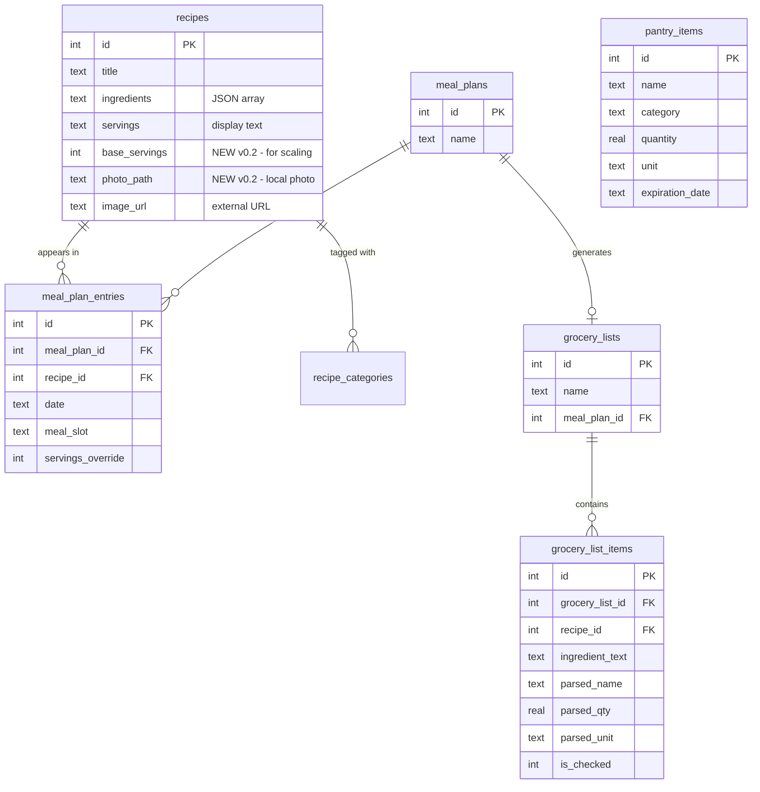

# Recipe App v0.2/v0.3 — htmx, Scaling, Meal Planner, Photos, OCR, Pantry

## Enhancement Summary

**Deepened on:** 2026-03-25
**Agents used:** 14 (architecture-strategist, performance-oracle, security-sentinel, data-integrity-guardian, agent-native-reviewer x2, code-simplicity-reviewer, data-migration-expert, julik-frontend-races-reviewer, + 5 research agents)

### Key Simplifications (user preference: simplicity first)

1. **REMOVED `parsed_ingredients` table** — parse on-the-fly at render time (~10ms for ~10 ingredients). No caching table, no batch parse job, no cache invalidation. ingredient-parser-nlp handles no-space format ("2tablespoons") natively — zero preprocessing needed.
2. **REMOVED `pint` dependency** — scaling is multiplication, not unit conversion. "2 cups" × 2 = "4 cups". Metric/imperial toggle deferred to v0.4+.
3. **REMOVED `rapidfuzz` dependency for v0.2** — pantry matching (v0.3) uses exact + substring matching first. Add fuzzy matching only if proven insufficient.
4. **REMOVED image migration script** — external URLs continue to work. Migrate if/when they break.
5. **KEPT MCP server as one file** — 400-500 lines with ~22 tools grouped by comment headers is manageable.
6. **Consolidated MCP tools from 27 to ~22** — merged trivial CRUD into existing tools, cut agent-unnecessary operations.
7. **Simplified `grocery_list_items` schema** — 5 columns (id, list_id, text, is_checked, sort_order) instead of 10 with parsed components.
8. **Removed `start_date/end_date` from `meal_plans`** — derivable from entries.

### Critical Security Additions

9. **CSRF protection is MANDATORY before htmx ships** — the app has zero CSRF protection. Use `fastapi-csrf-jinja` + `hx-headers='{{ csrf_header }}'` on `<body>`.
10. **Bleach sanitization gap** — only the scraper path calls `sanitize_field()`. Web forms, API, inline editing, pantry, grocery, OCR all store raw user input. Must add sanitization to all write paths.
11. **Photo upload: Pillow `Image.verify()` + re-encode** — validates magic bytes and strips payloads. Derive file extension from MIME type, never from user filename.
12. **OCR output sanitization** — all extracted fields must pass through `sanitize_field()` before storage.
13. **Prohibit `hx-on:*` attributes** — they require `unsafe-inline` in CSP. Use event listeners in `app.js` instead.

### Critical Architecture Additions

14. **`jinja2-fragments` (`Jinja2Blocks`)** — drop-in replacement for `Jinja2Templates`. Render named `` fragments for htmx, no separate partial files needed.
15. **`hx-sync="this:replace"` on all search inputs** — prevents out-of-order response race condition.
16. **`hx-push-url="true"` on search** — so browser back button restores search state.
17. **`hx-boost` selective, NOT on `<body>`** — apply to nav links and pagination only to avoid conflicting with forms.
18. **Write serialization via `asyncio.Lock`** — prevents transaction state pollution on shared aiosqlite connection.
19. **Migration: individual `db.execute()` calls, NOT `executescript()`** — each DDL statement idempotent with column-existence checks. Backup DB before migration.
20. **6 missing MCP tools added** — `delete_meal_plan`, `update_meal_plan`, `list_grocery_lists`, `delete_grocery_list`, `delete_recipe_photo`, plus pre-existing `create_category`/`delete_category`.
21. **`updated_at` triggers** on `meal_plans`, `grocery_lists`, `pantry_items` tables.
22. **`UNIQUE(name COLLATE NOCASE)` on `pantry_items`** — prevents duplicate pantry entries.
23. **`RECIPE_ANTHROPIC_API_KEY` must be added to Chef's MCP env block** due to `env_clear()`.
24. **Pin all dependency versions exactly** — `Pillow==12.1.0`, not `>=12.0`.

### New Dependencies (Revised)

| Package | Version | Purpose | Feature |
|---|---|---|---|
| htmx.min.js | 2.0.4 | Frontend interactivity (vendored) | 4 |
| ingredient-parser-nlp | ==2.6.0 | Parse ingredients → {qty, unit, item} | 5, 6, 9 |
| Pillow | ==12.1.0 | Photo thumbnails, EXIF, validation | 7, 8 |
| jinja2-fragments | ==1.11.0 | Render template blocks for htmx partials | 4 |
| fastapi-csrf-jinja | ==0.1.0 | CSRF protection for htmx mutations | 4 |

**Removed:** ~~pint~~ (YAGNI), ~~rapidfuzz~~ (defer to v0.4 if needed)

### Key Research Findings

- **ingredient-parser-nlp handles no-space format natively** — PreProcessor step 6 inserts spaces between qty/unit. Tested: "2tablespoons" → "2 tablespoons" → qty=2, unit=tablespoon, conf=1.0. Zero preprocessing needed for Paprika data.
- **Parse speed: ~800 sentences/sec** — 17,500 ingredients in ~22 seconds. foundation_foods=True is 100x slower — never enable it.
- **Memory: ~93MB peak RSS** — stable during batch processing, no leak.
- **Paprika 3 has NO "what can I make?" feature** — its pantry is purely a grocery list optimizer. Our v0.3 exceeds Paprika parity by a wide margin.
- **Pantry matching: `token_set_ratio` > `partial_ratio`** — "chicken" matches "chicken breast" with score 100 (token subset). Use score_cutoff=85 when/if fuzzy matching is added.
- **jinja2-fragments: Template Fragments pattern** — keep blocks in the same file as full pages. `block_name` parameter selects which block to render for htmx requests. No separate `partials/` directory needed.

## Overview

Six features across two milestones that evolve the recipe app from a basic CRUD/search tool into a full cooking companion with interactive UI, smart scaling, meal planning, photo management, OCR import, and pantry-based recipe suggestions. The v0.1 foundation (1,756 recipes, FTS5 search, MCP server with 8 tools, FastAPI + Jinja2 + SQLite) is solid — these features build on it.

**v0.2 (this release):** htmx interactivity, recipe scaling, grocery list + meal planner, local photo storage
**v0.3 (next release):** OCR scanning, pantry tracking + "What can I make?"

## Problem Statement / Motivation

The v0.1 app replaced Paprika 3's core recipe management but left significant gaps in the cooking workflow: no way to scale recipes, no meal planning, no grocery lists, full-page reloads for every interaction, and all images are external URLs that can go stale. The Chef agent has a meal-planner cron skill but no database tables to persist plans or generate shopping lists.

Paprika 3 has: ingredient scaling, cooking mode with strikethrough, meal planner, grocery list, and pantry. We need parity plus agent-native additions (MCP tools for every feature so Chef can use them).

## Technical Approach

### Architecture (v0.2 Evolution)

```
┌─────────────┐     stdio      ┌──────────────┐
│  Spacebot   │────────────────│  MCP Server  │
│  Chef Agent │                │  (fastmcp)   │──┐
└─────────────┘                │  27 tools    │  │
                               └──────────────┘  │  imports
┌─────────────┐     HTTP                          ▼
│  OpenClaw   │────────────────┐          ┌──────────────┐
│             │                │          │  Shared DB   │
└─────────────┘                │          │  Module      │
                               │          │  (db.py)     │──── /root/recipes/data/recipes.db
┌─────────────┐     HTTP       ▼          └──────────────┘
│  Browser    │──── http://localhost:8420 ──┐  ▲        ┌──────────────┐
│  (htmx)     │                            │  │        │  data/photos │
└─────────────┘                     ┌──────┴──┴─────┐  │  originals/  │
                                    │   FastAPI     │──│  thumbnails/ │
                                    │   + partials  │  └──────────────┘
                                    └───────────────┘
```

**Key changes from v0.1:**
- MCP server grows from 8 to 27 tools (split into modules)
- htmx replaces full-page reloads for search, editing, cooking mode
- Jinja2 templates gain partial fragments for htmx responses
- New `data/photos/` directory for local image storage
- 5 new database tables + 2 new columns on `recipes`
- Schema versioning via `PRAGMA user_version`

### New Dependencies

| Package | Version | Purpose | Feature |
|---|---|---|---|
| htmx.min.js | 2.0.4 | Frontend interactivity (vendored in static/) | 4 |
| ingredient-parser-nlp | ==2.6.0 | Parse "2 cups flour" → {qty, unit, item} | 5, 6, 9 |
| Pillow | ==12.1.0 | Photo thumbnail generation, EXIF handling, magic byte validation | 7, 8 |
| jinja2-fragments | ==1.11.0 | Render named template blocks for htmx partials | 4 |
| fastapi-csrf-jinja | ==0.1.0 | CSRF token generation + validation for htmx mutations | 4 |

**Removed from original plan:** ~~pint~~ (scaling is multiplication, not unit conversion — YAGNI), ~~rapidfuzz~~ (exact + substring matching sufficient for v0.3 pantry; add fuzzy matching in v0.4 if needed).

**Already present:** python-multipart (via fastapi[standard]), aiosqlite, jinja2, httpx, bleach.

### Database Schema Changes

#### New Columns on `recipes`

```sql
ALTER TABLE recipes ADD COLUMN base_servings INTEGER DEFAULT NULL;
ALTER TABLE recipes ADD COLUMN photo_path TEXT DEFAULT NULL;
```

#### New Tables

```sql
-- Schema versioning via PRAGMA user_version (no table needed)

-- NOTE: parsed_ingredients table REMOVED per simplicity review.
-- Ingredients are parsed on-the-fly at render time using ingredient-parser-nlp.
-- The library handles no-space format natively (~10ms for 10 ingredients, ~93MB RSS).
-- If performance becomes an issue at scale, add caching table in a future version.

-- Meal plans (start_date/end_date removed — derivable from entries)
CREATE TABLE IF NOT EXISTS meal_plans (
    id INTEGER PRIMARY KEY AUTOINCREMENT,
    name TEXT NOT NULL,
    created_at TEXT NOT NULL DEFAULT (datetime('now')),
    updated_at TEXT NOT NULL DEFAULT (datetime('now'))
);
CREATE TRIGGER IF NOT EXISTS trg_meal_plans_updated
AFTER UPDATE ON meal_plans
BEGIN UPDATE meal_plans SET updated_at = datetime('now') WHERE id = NEW.id; END;

-- Meal plan entries (recipes assigned to days/slots)
CREATE TABLE IF NOT EXISTS meal_plan_entries (
    id INTEGER PRIMARY KEY AUTOINCREMENT,
    meal_plan_id INTEGER NOT NULL REFERENCES meal_plans(id) ON DELETE CASCADE,
    recipe_id INTEGER NOT NULL REFERENCES recipes(id) ON DELETE CASCADE,
    date TEXT NOT NULL,
    meal_slot TEXT NOT NULL CHECK (meal_slot IN ('breakfast', 'lunch', 'dinner', 'snack')),
    servings_override INTEGER,
    created_at TEXT NOT NULL DEFAULT (datetime('now'))
);
CREATE INDEX IF NOT EXISTS idx_meal_plan_entries_plan ON meal_plan_entries(meal_plan_id);
CREATE INDEX IF NOT EXISTS idx_meal_plan_entries_recipe ON meal_plan_entries(recipe_id);
CREATE INDEX IF NOT EXISTS idx_meal_plan_entries_date ON meal_plan_entries(meal_plan_id, date);

-- Grocery lists
CREATE TABLE IF NOT EXISTS grocery_lists (
    id INTEGER PRIMARY KEY AUTOINCREMENT,
    name TEXT NOT NULL,
    meal_plan_id INTEGER REFERENCES meal_plans(id) ON DELETE SET NULL,
    created_at TEXT NOT NULL DEFAULT (datetime('now')),
    updated_at TEXT NOT NULL DEFAULT (datetime('now'))
);
CREATE TRIGGER IF NOT EXISTS trg_grocery_lists_updated
AFTER UPDATE ON grocery_lists
BEGIN UPDATE grocery_lists SET updated_at = datetime('now') WHERE id = NEW.id; END;

-- Grocery list items (simplified — store aggregated text, not parsed components)
CREATE TABLE IF NOT EXISTS grocery_list_items (
    id INTEGER PRIMARY KEY AUTOINCREMENT,
    grocery_list_id INTEGER NOT NULL REFERENCES grocery_lists(id) ON DELETE CASCADE,
    text TEXT NOT NULL,
    is_checked INTEGER NOT NULL DEFAULT 0 CHECK (is_checked IN (0, 1)),
    sort_order INTEGER NOT NULL DEFAULT 0
);
CREATE INDEX IF NOT EXISTS idx_grocery_list_items_list ON grocery_list_items(grocery_list_id);

-- Pantry items (v0.3)
CREATE TABLE IF NOT EXISTS pantry_items (
    id INTEGER PRIMARY KEY AUTOINCREMENT,
    name TEXT NOT NULL UNIQUE COLLATE NOCASE,
    category TEXT,
    quantity REAL,
    unit TEXT,
    expiration_date TEXT,
    created_at TEXT NOT NULL DEFAULT (datetime('now')),
    updated_at TEXT NOT NULL DEFAULT (datetime('now'))
);
CREATE INDEX IF NOT EXISTS idx_pantry_items_name ON pantry_items(name COLLATE NOCASE);
CREATE TRIGGER IF NOT EXISTS trg_pantry_items_updated
AFTER UPDATE ON pantry_items
BEGIN UPDATE pantry_items SET updated_at = datetime('now') WHERE id = NEW.id; END;
```

#### Schema Migration Strategy

Use SQLite's built-in `PRAGMA user_version` for versioning. **Critical: do NOT use `executescript()`** — it auto-commits each statement and breaks atomicity. Use individual `db.execute()` calls. Each DDL must be idempotent (check column existence before ALTER TABLE, use IF NOT EXISTS for CREATE TABLE).

```python
import shutil, sqlite3
from datetime import datetime

async def _column_exists(db, table: str, column: str) -> bool:
    cursor = await db.execute(f"PRAGMA table_info({table})")
    return any(row["name"] == column for row in await cursor.fetchall())

async def run_migrations(db: aiosqlite.Connection, db_path: str):
    row = await (await db.execute("PRAGMA user_version")).fetchone()
    version = row[0]

    if version < 1:
        # Backup before any migration
        backup = f"{db_path}.backup-v{version}-{datetime.now():%Y%m%d%H%M%S}"
        shutil.copy2(db_path, backup)

        # v0.2 migrations — idempotent, re-runnable
        if not await _column_exists(db, "recipes", "base_servings"):
            await db.execute("ALTER TABLE recipes ADD COLUMN base_servings INTEGER DEFAULT NULL")
        if not await _column_exists(db, "recipes", "photo_path"):
            await db.execute("ALTER TABLE recipes ADD COLUMN photo_path TEXT DEFAULT NULL")

        # Attempt to extract integer from servings TEXT into base_servings
        await db.execute("""
            UPDATE recipes SET base_servings = CAST(servings AS INTEGER)
            WHERE servings IS NOT NULL AND servings GLOB '[0-9]*'
              AND CAST(servings AS INTEGER) BETWEEN 1 AND 100
        """)

        # CREATE TABLE IF NOT EXISTS for all new tables...
        # (idempotent by definition)

        await db.execute("PRAGMA user_version = 1")
        await db.commit()

    if version < 2:
        # v0.3 migrations — pantry_items table
        # CREATE TABLE IF NOT EXISTS pantry_items (...)
        await db.execute("PRAGMA user_version = 2")
        await db.commit()
```

**Also update `schema.sql`** to include all v1/v2 objects with `PRAGMA user_version = 2` at the end, so fresh installs get the full schema and skip migrations.

#### ERD



### Implementation Phases

---

## Phase 1: Foundation — htmx + Schema Migration (Feature 4 + Infrastructure)

**Priority: Must ship first — all other features' UIs depend on htmx patterns.**

### 1a. htmx Setup + CSRF Protection

- [ ] Download htmx 2.0.4 and vendor into `/root/recipes/static/htmx.min.js`
- [ ] Download htmx `response-targets` extension and vendor into `/root/recipes/static/htmx-ext-response-targets.js`
- [ ] Add `<script src="/static/htmx.min.js"></script>` to `templates/base.html`
- [ ] Add `<script src="/static/htmx-ext-response-targets.js"></script>` to `templates/base.html`
- [ ] **Install `jinja2-fragments==1.11.0`** — replace `Jinja2Templates` with `Jinja2Blocks` (drop-in, adds `block_name` parameter for rendering template fragments)
- [ ] **Install `fastapi-csrf-jinja==0.1.0`** — add CSRF protection:
  - Add `<body hx-headers='{{ csrf_header | tojson | safe }}'>` to `base.html`
  - This auto-includes `X-CSRF-Token` on every htmx request
  - Validate token server-side on all POST/PUT/PATCH/DELETE routes
- [ ] Move ALL inline JS to `/root/recipes/static/app.js`:
  - `templates/recipes.html` lines 98-117 (import form handler)
  - `templates/recipe_form.html` lines 145-175 (nutrition rows + import)
  - `templates/recipe_detail.html` line 17 (`onsubmit` handler → replace with `hx-confirm`)
- [ ] **Prohibit `hx-on:*` attributes in all templates** — they require `unsafe-inline` in CSP. Use `addEventListener` in `app.js` instead.
- [ ] Verify CSP: `script-src 'self'` still works with all inline scripts removed
- [ ] Add `HX-Request` header detection (3 lines, no library):
  ```python
  hx_request: Annotated[str | None, Header()] = None
  ```
- [ ] **Add `sanitize_field()` to ALL write paths** — currently only the scraper path sanitizes. Add to: `_form_to_recipe_create()`, `_form_to_recipe_update()`, inline edit endpoints, pantry, grocery, meal plan name inputs.

### 1b. Template Fragments (NOT separate partial files)

**Use the Template Fragments pattern with `jinja2-fragments`** — keep blocks inline in existing templates, not in a separate `partials/` directory:

- [ ] In `recipes.html`: wrap the card grid in `...`
- [ ] In `recipe_detail.html`: wrap each editable field in ``, ``, etc.
- [ ] In routes: use `block_name="recipe_grid"` when `hx_request` is truthy:
  ```python
  block = "recipe_grid" if hx_request else None
  return templates.TemplateResponse(request, "recipes.html", context, block_name=block)
  ```
- [ ] For truly reusable components (recipe card used on 3+ pages), use Jinja2 `` in a `components/` directory

### 1c. Live Search-as-You-Type

- [ ] Add htmx attributes to search input in `recipes.html`:
  ```html
  <input type="search" name="q"
         hx-get="/"
         hx-trigger="input changed delay:300ms, keyup[key=='Enter'], search"
         hx-target="#recipe-grid"
         hx-sync="this:replace"
         hx-push-url="true"
         hx-indicator=".search-indicator">
  ```
- [ ] **`hx-sync="this:replace"` is critical** — cancels in-flight request when user types more, preventing stale results from overwriting fresh ones
- [ ] **`hx-push-url="true"`** — updates URL to `/?q=chicken` so browser back button restores search state
- [ ] Wrap search form so category + sort selectors share the sync group:
  ```html
  <form hx-sync="this:replace">
    <input type="search" ...>
    <select name="category" hx-get="/" hx-trigger="change" ...>
    <select name="sort" hx-get="/" hx-trigger="change" ...>
  </form>
  ```
- [ ] Add loading indicator with CSS `transition-delay: 200ms` on appearance to prevent flicker on fast responses
- [ ] **Apply `hx-boost="true"` selectively** to nav links and pagination — NOT to `<body>`. This avoids conflicts with delete forms, import form, and cooking mode.

### 1d. Inline Editing on Recipe Detail

- [ ] Create click-to-edit pattern for each editable field on `recipe_detail.html`:
  - Title, description, notes — text/textarea inputs
  - Prep time, cook time, servings, rating, difficulty, cuisine — specialized inputs
  - Categories — comma-separated input with current values
- [ ] Add `GET /recipe/{id}/edit/{field}` route → returns edit form block for that field
- [ ] Add `PUT /recipe/{id}/field/{field}` route → validates, updates, returns display block
- [ ] **Field allowlist** — route must reject any `{field}` not in: `{"title", "description", "notes", "prep_time_minutes", "cook_time_minutes", "servings", "rating", "difficulty", "cuisine", "categories"}`. Prevents arbitrary column injection.
- [ ] **Each field targets its own unique container** (`#field-title`, `#field-cuisine`, etc.) — prevents concurrent edits from clobbering each other
- [ ] **Add `hx-disabled-elt="this"` to save buttons** — prevents double-click submitting two PUTs
- [ ] **Sanitize values through `sanitize_field()`** before storage (defense-in-depth alongside Jinja2 auto-escaping)
- [ ] Ingredients and directions use the existing full edit form (too complex for inline)
- [ ] Replace delete form's `onsubmit="return confirm(...)"` with `hx-confirm="Delete this recipe?"` (htmx-native, works correctly with hx-boost)

### 1e. Cooking Mode with Ingredient Strikethrough

- [ ] Add "Start Cooking" button to `recipe_detail.html`
- [ ] **Decision: client-side only** — use JS in `app.js` that toggles a `strikethrough` class and persists to `localStorage` keyed by recipe ID. No server round-trip needed.
- [ ] Use **granular localStorage keys** per ingredient: `cooking-{id}-ingredient-{index}` (not one JSON blob) — prevents cross-tab clobbering
- [ ] Listen for `storage` event to sync cooking state across tabs (or document single-tab limitation)
- [ ] Add direction step highlighting (click current step to advance)
- [ ] "Done Cooking" button clears localStorage state
- [ ] **After scaling re-render: re-apply cooking state from localStorage** — scaling replaces ingredient DOM elements, so strikethrough classes must be re-applied

### 1f. Schema Migration Infrastructure

- [ ] Implement `run_migrations()` using `PRAGMA user_version` in `db.py`
- [ ] Call `run_migrations()` from the FastAPI lifespan after `init_schema()`
- [ ] Migration v1: add `base_servings INTEGER` and `photo_path TEXT` columns to `recipes`
- [ ] Migration v1: create `parsed_ingredients`, `meal_plans`, `meal_plan_entries`, `grocery_lists`, `grocery_list_items` tables
- [ ] Also update `schema.sql` to include all new tables for fresh installs

### 1g. Tests for Phase 1

- [ ] Test htmx partial responses (check `HX-Request` header handling)
- [ ] Test inline edit endpoints (PUT field, validation errors)
- [ ] Test schema migration from v0 → v1
- [ ] Test that existing pages still work without htmx (progressive enhancement)

---

## Phase 2: Recipe Scaling (Feature 5)

**Depends on: Phase 1 (schema migration for `base_servings`, htmx for UI)**

### 2a. Ingredient Parser Integration

- [ ] Add `ingredient-parser-nlp==2.6.0` to `pyproject.toml`
- [ ] Create `src/recipe_app/ingredient_parser.py` module:
  - `parse_ingredient(text: str) -> ParsedIngredient` — wraps `ingredient_parser.parse_ingredient()`
  - `parse_recipe_ingredients(ingredients: list[str]) -> list[dict]` — parse all ingredients, return list of {name, quantity, unit, original_text, preparation}
  - **No preprocessing needed!** The library's PreProcessor step 6 ("Enforce a space between quantities and units") handles the Paprika no-space format natively. Tested: "2tablespoons" → qty=2, unit=tablespoon, conf=1.0000.
  - Handle edge cases gracefully:
    - `amount=[]` (e.g., "salt to taste") → flag as not-scalable, pass through unchanged
    - `isinstance(amount.quantity, str)` (e.g., "1 dozen") → not scalable
    - Wrap in try/except for truly malformed input → return raw text unchanged
  - **Parse on-the-fly at render time** — no caching table, no batch job. ~10ms for 10 ingredients.
  - Run parsing in `asyncio.to_thread()` — ingredient-parser-nlp is CPU-bound (CRF model) and would block the event loop
- [ ] **No `parsed_ingredients` table** — eliminates cache invalidation, batch parsing, and schema complexity

### 2b. Scaling Logic

- [ ] Create `src/recipe_app/scaling.py` module:
  - `scale_ingredient(parsed: dict, factor: float) -> dict` — multiply quantity by factor
  - `format_quantity(value: float) -> str` — display as cooking fraction using `fractions.Fraction.limit_denominator(8)` (stdlib, no dependency needed). Common fractions: 1/8, 1/4, 1/3, 1/2, 2/3, 3/4.
  - Supported multipliers: 1/8, 1/4, 1/3, 1/2, 1, 1.5, 2, 3, 4, 6, 8
  - Items with no quantity (e.g., "salt to taste") pass through unchanged
  - Items with string quantities (e.g., "1 dozen") pass through unchanged
- [ ] **No unit conversion** — scaling is multiplication. "2 cups" × 2 = "4 cups". Metric/imperial toggle deferred to v0.4+.

### 2c. Scaling UI

- [ ] Add scaling widget to `recipe_detail.html`:
  - Display base servings (or "Set servings" prompt if NULL)
  - Multiplier buttons: ×1/2, ×1, ×2, ×3, ×4 (most common)
  - Custom multiplier input for other values
- [ ] **Client-side scaling**: embed parsed ingredient data using `{{ ingredients_json|tojson }}` in `data-` attributes (NOT in a `<script>` tag — avoids XSS from `</script>` in ingredient text). JS in `app.js` handles the math for instant updates without server round-trips.
- [ ] When `base_servings` is NULL, show a prompt: "How many servings does this recipe make?" with an htmx PUT to set it
- [ ] **After scaling re-render, re-apply cooking mode state from localStorage** (scaling replaces DOM elements)

### 2d. MCP Tools for Scaling

- [ ] **Use existing `update_recipe` tool** for setting base_servings — add `base_servings` as an accepted field. No separate tool needed.
- [ ] `scale_recipe(recipe_id: int, multiplier: float)` — returns **structured data** `{"scaled_ingredients": [{name, quantity, unit, original_text}], "formatted_text": "..."}` so the agent can use quantities programmatically (not just text)

### 2e. Tests for Phase 2

- [ ] Test ingredient parser against 50 real ingredients from the database (including no-space format)
- [ ] Test scaling math: fractions, whole numbers, ranges, "to taste" passthrough
- [ ] Test format_quantity: 0.5→"1/2", 0.333→"1/3", 0.25→"1/4", 3.0→"3"
- [ ] Test unit conversion: cups↔ml, oz↔g
- [ ] Test MCP tools: set_base_servings, scale_recipe

---

## Phase 3: Grocery List + Meal Planner (Feature 6)

**Depends on: Phase 1 (tables created), Phase 2 (ingredient parser for aggregation)**

### 3a. Meal Plan CRUD

- [ ] Add `db.py` functions:
  - `create_meal_plan(db, name, start_date, end_date) -> int`
  - `get_meal_plan(db, plan_id) -> dict` (with entries and recipe titles)
  - `list_meal_plans(db) -> list[dict]`
  - `delete_meal_plan(db, plan_id)`
  - `add_meal_plan_entry(db, plan_id, recipe_id, date, meal_slot, servings_override=None)`
  - `remove_meal_plan_entry(db, entry_id)`
- [ ] Add REST API routes in new `routers/meal_plans.py`:
  - `GET /api/meal-plans` — list
  - `POST /api/meal-plans` — create
  - `GET /api/meal-plans/{id}` — get with entries
  - `DELETE /api/meal-plans/{id}` — delete
  - `POST /api/meal-plans/{id}/entries` — add recipe
  - `DELETE /api/meal-plans/entries/{entry_id}` — remove recipe

### 3b. Meal Plan Web UI

- [ ] Create `templates/meal_plans.html` — list of meal plans with create form
- [ ] Create `templates/meal_plan_detail.html` — calendar/list view of a plan
  - Days as rows, meal slots as columns
  - Recipe cards in each slot (clickable to view recipe)
  - "Add recipe" button per slot → htmx search modal to find and add a recipe
  - Drag-and-drop reordering (htmx `hx-swap` on drop) — **deferred, use add/remove for v0.2**
- [ ] Create `partials/meal_plan_entry.html` — single entry for htmx add/remove
- [ ] Add "Meal Plans" to navbar in `base.html`
- [ ] Add web routes in `main.py`:
  - `GET /meal-plans` — list page
  - `GET /meal-plans/{id}` — detail page
  - `POST /meal-plans` — create (form submit)
  - `POST /meal-plans/{id}/add-recipe` — add recipe to plan (htmx)

### 3c. Grocery List Generation

- [ ] Add `db.py` functions:
  - `generate_grocery_list(db, plan_id=None, recipe_ids=None, name=None) -> int`
    - Collects all ingredients from the specified recipes or meal plan
    - Parses each ingredient (using cached `parsed_ingredients` or parsing on the fly)
    - Aggregates by parsed name + unit: sum quantities for matching items
    - Falls back to raw string listing for unparseable ingredients
    - Inserts into `grocery_lists` + `grocery_list_items`
  - `get_grocery_list(db, list_id) -> dict`
  - `list_grocery_lists(db) -> list[dict]`
  - `check_grocery_item(db, item_id, is_checked: bool)`
  - `add_grocery_item(db, list_id, item_text: str)` — ad-hoc items
  - `delete_grocery_list(db, list_id)`

### 3d. Grocery List Web UI

- [ ] Create `templates/grocery_lists.html` — list of grocery lists
- [ ] Create `templates/grocery_list_detail.html` — checkable shopping list
  - Items grouped by parsed name (alphabetical for v0.2; aisle grouping deferred to v0.3)
  - Checkbox per item → `hx-post` toggles `is_checked`
  - Checked items move to bottom with strikethrough
  - "Add item" text input at bottom → `hx-post` adds ad-hoc item
  - "Generate from meal plan" button on meal plan detail page
- [ ] Create `partials/grocery_item.html` — single item for htmx toggle
- [ ] Add "Grocery Lists" to navbar in `base.html`
- [ ] Add web routes:
  - `GET /grocery-lists` — list page
  - `GET /grocery-lists/{id}` — detail page
  - `POST /grocery-lists/generate` — generate from meal plan or recipe IDs
  - `POST /grocery-lists/{id}/check/{item_id}` — toggle check (htmx)
  - `POST /grocery-lists/{id}/add-item` — add ad-hoc item (htmx)

### 3e. MCP Tools for Meal Planning + Grocery

- [ ] `create_meal_plan(name)` — returns full created plan object
- [ ] `get_meal_plan(plan_id)` — returns plan with entries and recipe titles
- [ ] `list_meal_plans()` — returns all plans (agent needs to discover existing plans)
- [ ] `update_meal_plan(plan_id, name=None)` — rename a plan
- [ ] `delete_meal_plan(plan_id)` — **was missing — agent must be able to clean up stale plans**
- [ ] `add_recipe_to_meal_plan(plan_id, recipe_id, date, meal_slot, servings=None)` — document valid `meal_slot` values in tool description: "breakfast", "lunch", "dinner", "snack"
- [ ] `remove_recipe_from_meal_plan(entry_id)`
- [ ] `generate_grocery_list(plan_id=None, recipe_ids=None, name=None)` — returns **full grocery list with items** (not just ID) so Chef cron can format for Slack in one call
- [ ] `list_grocery_lists()` — **was missing — agent needs to discover existing lists**
- [ ] `get_grocery_list(list_id)`
- [ ] `delete_grocery_list(list_id)` — **was missing — agent must be able to clean up old lists**
- [ ] Also add **pre-existing missing tools**: `create_category(name)` and `delete_category(category_id)` — the REST API has these but the MCP server does not

**Integration with Chef's existing meal-planner cron skill:** The Chef agent's weekly cron currently delivers meal plans via Slack. With these new MCP tools, Chef can now persist plans to the database and generate grocery lists automatically. The cron workflow should be updated to call `create_meal_plan` + `add_recipe_to_meal_plan` + `generate_grocery_list` instead of (or in addition to) just formatting a Slack message.

### 3f. Tests for Phase 3

- [ ] Test meal plan CRUD (create, add entries, get, delete, cascade)
- [ ] Test grocery list generation from meal plan (aggregation, deduplication)
- [ ] Test grocery list generation from ad-hoc recipe list
- [ ] Test item check/uncheck
- [ ] Test unparseable ingredient fallback (raw string, no aggregation)
- [ ] Test MCP tools

---

## Phase 4: Local Photo Storage (Feature 7)

**Depends on: Phase 1 (schema migration for `photo_path`)**

### 4a. Photo Storage Infrastructure

- [ ] Add `Pillow>=12.0` to `pyproject.toml`
- [ ] Create `data/photos/originals/` and `data/photos/thumbnails/` directories
- [ ] Add `RECIPE_PHOTO_DIR` config setting (default: `data/photos`), add to `config.py`
- [ ] Mount static files: `app.mount("/photos", StaticFiles(directory=config.photo_dir), name="photos")`

### 4b. Upload Endpoint

- [ ] Create `POST /api/recipes/{id}/photo` endpoint:
  - Accept `UploadFile` (multipart form)
  - Validate content type: allow `image/jpeg`, `image/png`, `image/webp` only
  - Validate file size: reject if > `config.max_photo_size` (10MB)
  - Validate magic bytes (not just content-type header)
  - Generate UUID filename: `{uuid4().hex}.{ext}`
  - Save original to `data/photos/originals/{filename}`
  - Generate thumbnail (400x400 max, preserve aspect ratio) using Pillow:
    - `ImageOps.exif_transpose()` for phone photo rotation
    - `Image.thumbnail((400, 400))`
    - Save as JPEG with `quality=85, optimize=True`
    - Strip EXIF metadata from thumbnail
  - Update `recipes.photo_path` column with the filename
  - Set `Image.MAX_IMAGE_PIXELS = 50_000_000` to prevent decompression bombs
- [ ] Create `DELETE /api/recipes/{id}/photo` endpoint:
  - Remove files from both `originals/` and `thumbnails/`
  - Set `photo_path` to NULL

### 4c. Web UI Updates

- [ ] Update `templates/recipe_form.html`:
  - Add file upload input alongside existing `image_url` text field
  - "Upload Photo" dropzone or button
  - Preview before upload
- [ ] Update `templates/recipe_detail.html`:
  - Display logic: prefer `photo_path` (local) over `image_url` (external)
  - If local: ``
  - If external: existing ``
- [ ] Update `templates/recipes.html` card grid:
  - Fix line 42-43 `startswith('https')` check to also handle local photos
  - Show thumbnail in grid: `/photos/thumbnails/{photo_path}`
- [ ] Add `POST /recipe/{id}/upload-photo` web route for form-based upload (redirects back to recipe)

### 4d. MCP Tools

- [ ] `upload_recipe_photo(recipe_id: int, image_base64: str)` — accepts base64-encoded image data, decodes, validates, stores. **Document in tool description:** base64 encoding inflates data ~33%, so effective max is ~13.3MB base64 for a 10MB image. Validate decoded size against `config.max_photo_size`.
- [ ] `delete_recipe_photo(recipe_id: int)` — **was missing — agent must be able to remove incorrect photos**

### 4e. Image Migration Script — REMOVED

**Removed per simplicity review.** External image URLs from `image_url` column continue to work. The 1,678 NYT/CDN URLs are stable. If/when URLs start returning 404s, write a migration script then. Do not solve a problem that does not exist.

If a migration script is ever needed, it MUST:
- Create a **separate** `fetch_image_safely()` function (not modify `fetch_url_safely()`) with DNS pinning + IP validation
- Accept only `image/jpeg`, `image/png`, `image/webp` content types
- Validate downloaded content with `PIL.Image.verify()` before saving
- Use `config.max_photo_size` as size limit (not `max_response_size`)
- Reject redirects or re-validate each hop's resolved IP

### 4f. Tests for Phase 4

- [ ] Test photo upload (valid JPEG, valid PNG, valid WebP)
- [ ] Test rejection: oversized file, SVG, executable, invalid content-type
- [ ] Test thumbnail generation (correct dimensions, EXIF rotation)
- [ ] Test photo deletion (files removed, column nulled)
- [ ] Test template display logic (local photo preferred over image_url)
- [ ] Test decompression bomb protection

---

## Phase 5: OCR Scanning (Feature 8) — v0.3

**Depends on: Phase 4 (photo upload infrastructure)**

### 5a. Vision API Integration

- [ ] Create `src/recipe_app/ocr.py` module:
  - **Primary: Claude Vision** (already available via the same Anthropic API key used by spacebot)
  - `async def extract_recipe_from_image(image_bytes: bytes) -> dict`:
    - Sends image to Claude Sonnet with structured extraction prompt
    - Prompt requests JSON output: `{title, description, ingredients[], directions[], servings, prep_time_minutes, cook_time_minutes, notes}`
    - Returns parsed dict
  - Fallback: if API fails, return error with suggestion to enter manually
- [ ] Add `RECIPE_ANTHROPIC_API_KEY` as a **dedicated** env var (do not reuse spacebot's key — if the recipe app is compromised, the key scope is limited). **Must also be added to Chef's `[[agents.mcp]]` env block** in `config.toml` due to `env_clear()`: `env = { "HOME" = "/root", "RECIPE_ANTHROPIC_API_KEY" = "secret:recipe_anthropic_api_key" }`
- [ ] **Sanitize ALL OCR output through `sanitize_field()`** before storing or displaying — a crafted image could contain text that looks like HTML/JS
- [ ] Validate extracted data against Pydantic models (RecipeCreate) before accepting
- [ ] Rate-limit the `/scan` endpoint (e.g., 10 requests per minute) to prevent cost abuse
- [ ] Extraction prompt should:
  - Handle both printed cookbook text and handwritten cards
  - Normalize abbreviations ("tsp" → "teaspoon", "c." → "cup")
  - Separate ingredients into individual list items
  - Number direction steps
  - Flag low-confidence extractions

### 5b. OCR Web UI Flow

- [ ] Add "Scan Recipe" button/link to navbar and `/add` page
- [ ] Create `templates/scan_recipe.html`:
  - Photo upload form (reuse photo upload component from Phase 4)
  - "Processing..." indicator while OCR runs
  - After extraction: pre-populate the recipe add form with extracted data
  - User reviews, corrects, and saves
- [ ] Add web routes:
  - `GET /scan` — scan page with upload form
  - `POST /scan` — upload photo, run OCR, redirect to `/add` with pre-filled fields
- [ ] The `/add` route should accept query parameters or session data to pre-fill fields

### 5c. MCP Tool

- [ ] `ocr_scan_recipe(image_base64: str) -> dict` — accepts base64 image, runs OCR, returns extracted fields. Chef agent can then call `create_recipe` with the result.

### 5d. Tests for Phase 5

- [ ] Test OCR extraction with a sample cookbook page image
- [ ] Test OCR extraction with a handwritten recipe card
- [ ] Test error handling: API timeout, invalid image, no recipe content detected
- [ ] Test the full flow: upload → extract → pre-fill form → save recipe
- [ ] Test MCP tool

---

## Phase 6: Pantry + "What Can I Make?" (Feature 9) — v0.3

**Depends on: Phase 2 (ingredient parser), Phase 1 (schema migration)**

### 6a. Pantry CRUD

- [ ] Add `db.py` functions:
  - `add_pantry_item(db, name, category=None, quantity=None, unit=None, expiration_date=None) -> int`
  - `update_pantry_item(db, item_id, **kwargs)`
  - `delete_pantry_item(db, item_id)`
  - `list_pantry_items(db) -> list[dict]`
  - `get_expiring_items(db, days_ahead: int = 3) -> list[dict]`
- [ ] Add REST API routes in new `routers/pantry.py`:
  - `GET /api/pantry` — list items
  - `POST /api/pantry` — add item
  - `PATCH /api/pantry/{id}` — update item
  - `DELETE /api/pantry/{id}` — delete item

### 6b. Pantry Web UI

- [ ] Create `templates/pantry.html`:
  - List of pantry items (name, quantity, unit, expiry indicator)
  - Quick-add text input at top: type name, press Enter → `hx-post` adds item
  - Edit/delete per item (htmx inline edit, same pattern as recipe fields)
  - Visual indicator for items expiring within 3 days (yellow/red highlight)
  - "What Can I Make?" button → navigates to results
- [ ] Add "Pantry" to navbar in `base.html`
- [ ] Add web routes:
  - `GET /pantry` — pantry page
  - `POST /pantry/add` — add item (htmx)
  - `POST /pantry/edit/{id}` — edit item (htmx)
  - `POST /pantry/delete/{id}` — delete item (htmx)

### 6c. "What Can I Make?" Matching Engine

- [ ] Create `src/recipe_app/pantry_matcher.py`:
  - `async def find_matching_recipes(db, max_missing: int = 2) -> list[dict]`:
    - Fetches all pantry item names (case-insensitive via COLLATE NOCASE)
    - For each recipe, parses ingredients on-the-fly (or uses a simple in-memory cache keyed by recipe_id)
    - **Matching strategy (two-tier, no extra dependency):**
      1. **Exact match** (case-insensitive, trimmed) — pantry "flour" matches ingredient "flour"
      2. **Substring containment** — pantry "chicken" matches ingredient "boneless skinless chicken breast"
    - Returns recipes sorted by: (1) % ingredients available DESC, (2) missing count ASC
    - Each result includes: recipe summary, available ingredients (green), missing ingredients (red), match percentage
    - **Boolean matching only** (have/don't have) — quantity comparison deferred to v0.4+
  - Performance: build an in-memory ingredient name index on first query: `{ingredient_name: set(recipe_ids)}` from parsing all recipes' ingredient lists. With ~2,500 distinct ingredient names, matching 50 pantry items takes <50ms.
  - Run matching in `asyncio.to_thread()` if it blocks the event loop
- [ ] **No `rapidfuzz` dependency** — exact + substring matching covers the documented cases ("chicken" matches "chicken breast", "flour" matches "all-purpose flour"). If proven insufficient after real usage, add fuzzy matching with `rapidfuzz.fuzz.token_set_ratio(score_cutoff=85)` in v0.4.

### 6d. "What Can I Make?" Web UI

- [ ] Create `templates/pantry_matches.html`:
  - Filter: "Show recipes missing at most N ingredients" (slider: 0, 1, 2, 3, 5, any)
  - Recipe cards with match percentage badge
  - Each card shows: available ingredients (green checkmarks), missing ingredients (red X)
  - Click card → recipe detail page
- [ ] Add web route:
  - `GET /pantry/what-can-i-make` — matching results page
  - `GET /pantry/what-can-i-make` with `HX-Request` → partial results for htmx filtering

### 6e. MCP Tools for Pantry

- [ ] `add_pantry_item(name, category=None, quantity=None, unit=None, expiration_date=None)`
- [ ] `delete_pantry_item(item_id)` — renamed from `remove_*` for naming consistency (`delete_*` = permanent removal, `remove_*` = detach association)
- [ ] `list_pantry_items(expiring_within_days=None)` — merged `get_expiring_items` into this tool as an optional filter parameter. When `expiring_within_days=3`, returns only items expiring within 3 days.
- [ ] `update_pantry_item(item_id, name=None, quantity=None, unit=None, expiration_date=None)`
- [ ] `find_recipes_from_pantry(max_missing=2)` — the core query

**Note:** All tool names are prefixed with `recipes_` by spacebot's namespace system. Chef sees these as `recipes_add_pantry_item`, `recipes_find_recipes_from_pantry`, etc. References in Chef's cron workflow and tool-nudging config must use the prefixed names.

**Integration with Chef agent:** Chef's cron can call `get_expiring_items(3)` to find items about to expire, then `find_recipes_from_pantry()` to suggest recipes that use them, and deliver suggestions via Slack: "Your chicken expires Thursday — here are 5 recipes you can make tonight."

### 6f. Paprika Parity Check

Paprika 3's pantry is actually minimal: a simple ingredient list with text-match recipe filtering. Our v0.3 implementation **exceeds Paprika parity** with:
- Quantity tracking (Paprika: no)
- Expiry dates (Paprika: no)
- Fuzzy matching (Paprika: exact text only)
- Match percentage ranking (Paprika: binary match/no-match)
- Agent-driven proactive suggestions (Paprika: no agent access)

### 6g. Tests for Phase 6

- [ ] Test pantry CRUD
- [ ] Test matching: exact match, substring match, fuzzy match
- [ ] Test ranking: recipes sorted by availability percentage
- [ ] Test max_missing filter
- [ ] Test with empty pantry (no matches)
- [ ] Test with full pantry (all recipes match)
- [ ] Test expiring items query
- [ ] Test MCP tools

---

## Alternative Approaches Considered

### Ingredient Parser

| Approach | Verdict |
|---|---|
| `ingredient-parser-nlp` (ML/CRF) | **Chosen** — 95% sentence accuracy, handles fractions, returns Fraction objects ideal for scaling |
| Custom regex | Fragile; fails on "2 1/2 cups", "one 14-oz can", "salt to taste". Would need constant maintenance. |
| LLM-based parsing per ingredient | Too slow and expensive for 1,756 recipes × ~10 ingredients each. Good for OCR output cleanup, not batch parsing. |
| `spaCy` custom NER | Requires labeling training data. ingredient-parser-nlp already did this with 81K sentences. |

**Preprocessing required:** The Paprika import data has no spaces between numbers and units ("2tablespoons"). A regex preprocessing step (`(\d)(tablespoons?|...)` → `\1 \2`) is needed before passing to the parser.

### Scaling Approach

| Approach | Verdict |
|---|---|
| Client-side JS with embedded JSON | **Chosen** — instant updates, no server round-trips, works with cooking mode |
| Server-side htmx per scale change | Too many requests for a slider/button interaction. Adds latency. |
| Pre-computed scaled variants in DB | Storage explosion. Not practical for arbitrary multipliers. |

### OCR Engine

| Approach | Verdict |
|---|---|
| Claude Vision (Sonnet) | **Chosen** — already in stack via spacebot, excellent at structured extraction, handles handwriting |
| pytesseract (local) | Poor handwriting support, requires Tesseract binary install, needs custom parsing after OCR |
| Google Cloud Vision | Good accuracy but adds a separate API key and billing account |

### Pantry Matching

| Approach | Verdict |
|---|---|
| Three-tier (exact + substring + rapidfuzz) | **Chosen** — good balance of accuracy and simplicity |
| Embedding-based semantic search | Overkill for ingredient matching. Requires a model. |
| LLM per recipe | Way too slow for 1,756 recipes on every query |
| FTS5 only | Misses fuzzy matches ("chicken" vs "chicken breast" works, but "flour" vs "all-purpose flour" is harder) |

## System-Wide Impact

### Interaction Graph

- **htmx requests** → FastAPI routes → check `HX-Request` header → return partial or full template
- **Scaling widget** (client-side) → no server interaction except initial parse + `set_base_servings`
- **Grocery list generation** → reads `parsed_ingredients` → aggregates → writes `grocery_list_items`
- **Photo upload** → FastAPI `UploadFile` → Pillow thumbnail → filesystem write → DB update
- **OCR** → photo upload → Anthropic API call → pre-fill recipe form → standard `create_recipe` flow
- **Pantry matching** → reads `pantry_items` + `parsed_ingredients` → in-memory matching → returns ranked results

### Error Propagation

- **Ingredient parser failures**: gracefully degrade — unparseable ingredients display as-is, scaling disabled for that item, grocery list includes raw text
- **Photo upload failures**: HTTP 413 (too large), 415 (wrong type), 500 (disk full) — all surfaced in UI with htmx error handling
- **OCR API timeout**: show "Extraction failed, please try again or enter manually" — redirect to standard add form
- **Pantry fuzzy match false positives**: acceptable — user sees suggested recipes and uses judgment

### Write Serialization

Add an `asyncio.Lock` around all write transactions in `db.py` to prevent transaction state pollution when multiple concurrent async handlers share the same `aiosqlite.Connection`:

```python
_write_lock = asyncio.Lock()

async def write_transaction(db, coro):
    async with _write_lock:
        return await coro
```

This prevents: (a) two requests interleaving writes inside one transaction, (b) MCP agent write blocking web UI for 5+ seconds during grocery list generation.

### State Lifecycle Risks

- **Partial grocery list generation**: wrap all reads OUTSIDE the write transaction, compute aggregation in Python, then do one fast `executemany` insert inside `BEGIN IMMEDIATE`.
- **Photo upload + DB update**: write file first, then update DB. If DB update fails, delete file in `except` block. Add periodic orphan cleanup (scan `data/photos/originals/` for files not referenced by any `photo_path`).
- **Schema migration**: each DDL is idempotent (column-existence check, IF NOT EXISTS). Backup before migration. See hardened migration pattern in Schema Migration Strategy section.

### API Surface Parity

All new features get both Web UI routes AND MCP tools, ensuring agent-native parity:

| Feature | Web Routes | MCP Tools |
|---|---|---|
| Scaling | UI-only (client-side JS) | `scale_recipe` (+ `base_servings` via existing `update_recipe`) |
| Meal Plans | 6 routes | 7 tools (create, get, list, update, delete, add_entry, remove_entry) |
| Grocery Lists | 5 routes | 4 tools (generate, get, list, delete) |
| Photos | 3 routes | 2 tools (upload, delete) |
| OCR | 2 routes | 1 tool |
| Pantry | 5 routes | 5 tools (add, delete, list, update, find_recipes) |
| Categories (fix) | existing | 2 tools (create, delete — pre-existing gap fixed) |
| **Total new** | **21 routes** | **~22 tools (from 8 existing to ~30 total)** |

### MCP Server Structure

The MCP server grows from 8 to ~22 tools. **Keep as a single file** (`mcp_server.py`) with comment-block grouping by domain. A 400-500 line file with ~22 short tool functions is manageable. Split into modules only if it exceeds ~800 lines.

```python
# mcp_server.py structure (single file):
# --- Recipe Tools (8 existing + 2 new: create_category, delete_category) ---
# --- Scaling Tools (1: scale_recipe) ---
# --- Meal Plan Tools (7: create, get, list, update, delete, add_entry, remove_entry) ---
# --- Grocery Tools (4: generate, get, list, delete) ---
# --- Photo Tools (2: upload, delete) ---
# --- OCR Tools (1: ocr_scan_recipe) ---
# --- Pantry Tools (5: add, delete, list, update, find_recipes) ---
```

Also update the MCP integration spec at `/root/spacebot/docs/design-docs/recipe-app-mcp-integration.md` with the full ~22-tool table.

## Acceptance Criteria

### Functional Requirements

- [ ] **htmx**: Search results update without page reload within 300ms of typing pause
- [ ] **htmx**: Recipe fields can be edited inline on the detail page
- [ ] **htmx**: Cooking mode allows ingredient strikethrough with state persisted in localStorage
- [ ] **Scaling**: Ingredients scale correctly for multipliers 1/8x through 8x
- [ ] **Scaling**: Quantities display as cooking fractions (1/4, 1/3, 1/2, 2/3, 3/4)
- [ ] **Scaling**: "To taste" and unparseable ingredients pass through unchanged
- [ ] **Meal Plan**: Create, view, and manage meal plans with recipes in day/slot grid
- [ ] **Grocery List**: Generate aggregated grocery list from meal plan or recipe selection
- [ ] **Grocery List**: Check off items with persistent state
- [ ] **Photos**: Upload JPEG/PNG/WebP photos up to 10MB per recipe
- [ ] **Photos**: Thumbnails auto-generated at 400x400 max
- [ ] **Photos**: Local photos display in grid and detail views
- [ ] **OCR** (v0.3): Photograph a cookbook page and extract recipe fields
- [ ] **Pantry** (v0.3): Add/manage pantry items
- [ ] **Pantry** (v0.3): "What can I make?" returns recipes ranked by ingredient availability

### Non-Functional Requirements

- [ ] All new features have MCP tool equivalents (agent-native parity)
- [ ] No regression in existing search, CRUD, or import functionality
- [ ] htmx operates with progressive enhancement — app still works without JS
- [ ] Photo uploads enforce content-type + magic byte validation (security)
- [ ] CSP headers maintained — no inline scripts, htmx self-hosted
- [ ] Existing 7 test files pass; new tests added per phase

### Quality Gates

- [ ] All existing tests pass (`pytest`)
- [ ] New tests added for each phase (target: 80%+ coverage of new code)
- [ ] No new security warnings (SSRF, XSS, path traversal)
- [ ] Schema migration tested: fresh install AND upgrade from v0.1

## Success Metrics

- **htmx**: Search interaction feels instantaneous (< 200ms perceived latency)
- **Scaling**: > 90% of ingredients parse correctly from the existing 1,756 recipes
- **Grocery List**: Ingredient aggregation correctly combines > 80% of duplicates
- **Photos**: Upload-to-display cycle < 3 seconds
- **OCR**: > 85% accuracy on printed cookbook pages (measured by field correctness)
- **Pantry**: "What can I make?" returns relevant results with < 500ms query time

## Dependencies & Prerequisites

- **ingredient-parser-nlp 2.6.0** — requires Python >= 3.11 (we have 3.12, OK)
- **Pillow >= 12.0** — requires system libraries (libjpeg, libpng) — verify installed on server
- **Anthropic API key** — needed for OCR (v0.3). Check if spacebot's key can be reused.
- **htmx 2.0.4** — download and vendor, no Python dependency
- **rapidfuzz >= 3.0** — C++ extension, may need build tools

## Risk Analysis & Mitigation

| Risk | Impact | Likelihood | Mitigation |
|---|---|---|---|
| ~~Ingredient parser fails on no-space format~~ | ~~Scaling broken~~ | **RESOLVED** | Parser handles natively — PreProcessor step 6 inserts spaces. Tested. |
| 1,756 recipes have no base_servings | Scaling widget unusable | Certain | Allow NULL → show "set servings" prompt; migration extracts integer from TEXT where possible; Chef batch-fills rest |
| CSRF attacks on htmx mutations | Data modification via malicious page | Medium | **MUST ADD** `fastapi-csrf-jinja` before htmx ships |
| XSS via unsanitized user input | Stored XSS on all write paths | Medium | **MUST ADD** `sanitize_field()` to web form + inline edit + pantry + grocery + OCR write paths |
| Photo upload malicious files | SVG script injection, polyglot files | Medium | Pillow `Image.verify()` + re-encode + magic byte validation + UUID filenames from MIME type |
| OCR prompt injection via crafted images | Malicious text extracted into recipe fields | Low | Sanitize all OCR output through bleach; validate against Pydantic models |
| SQLite write contention with ~22 MCP tools + web UI | Timeouts during Chef cron runs | Medium | `asyncio.Lock` write serialization + short transactions (reads outside lock) |
| Anthropic API rate limits for OCR | OCR slow or unavailable | Low | Rate limit on our end (10/min); fallback to manual entry |
| Schema migration partial failure | App stuck in boot loop | Low | Idempotent migration (column-existence checks, IF NOT EXISTS); backup before migration |

## Future Considerations (v0.4+)

- **Subcategories** — nested category tree
- **Soft delete / trash** — recoverable deletion with 30-day cleanup
- **Recipe-to-recipe links** — `[recipe:Chicken Stock]` syntax in directions
- **Timer detection** — parse "bake for 25 minutes" into tappable timers
- **Photo embedding in directions** — step-by-step photo guide
- **Pantry deduction after cooking** — auto-reduce quantities
- **Grocery list aisle grouping** — organize by store department
- **Multi-user auth** — if the app ever needs to support more than one person
- **Paprika format import** — `.paprikarecipes` file support
- **Wake Lock API** — keep screen on during cooking mode (mobile)

## Sources & References

### Origin

- **v0.1 Plan:** [/root/docs/plans/2026-03-24-001-feat-recipe-app-paprika-replacement-plan.md] — foundation architecture, Paprika feature audit, tech stack decisions

### Internal References

- Architecture: `/root/recipes/src/recipe_app/main.py` — FastAPI app, CSP middleware (line 38), web routes
- Database: `/root/recipes/src/recipe_app/db.py` — all CRUD operations, FTS5 search
- Schema: `/root/recipes/src/recipe_app/sql/schema.sql` — current DDL
- Models: `/root/recipes/src/recipe_app/models.py` — Pydantic models, `servings` is `str | None`
- MCP server: `/root/recipes/src/recipe_app/mcp_server.py` — 8 current tools
- Config: `/root/recipes/src/recipe_app/config.py` — `max_photo_size=10MB` already defined
- Scraper: `/root/recipes/src/recipe_app/scraper.py` — `fetch_url_safely()`, `sanitize_fts5_query()`
- Templates: `/root/recipes/src/recipe_app/templates/` — 4 Jinja2 files
- Security hardening: `/root/docs/solutions/security-issues/fastapi-ssrf-xss-csp-hardening.md`
- MCP integration spec: `/root/spacebot/docs/design-docs/recipe-app-mcp-integration.md`
- Chef cron workflow: `/root/docs/solutions/integration-issues/cron-workflow-setup-credentials-slack-delivery.md`

### External References

- htmx docs: https://htmx.org/docs/
- ingredient-parser-nlp: https://pypi.org/project/ingredient-parser-nlp/ (v2.6.0, 95% accuracy)
- Pillow thumbnail docs: https://pillow.readthedocs.io/en/stable/handbook/tutorial.html
- FastAPI file uploads: https://fastapi.tiangolo.com/tutorial/request-files/
- rapidfuzz: https://github.com/rapidfuzz/RapidFuzz
- pint unit conversion: https://pint.readthedocs.io/
- Claude Vision: https://docs.anthropic.com/en/docs/build-with-claude/vision
