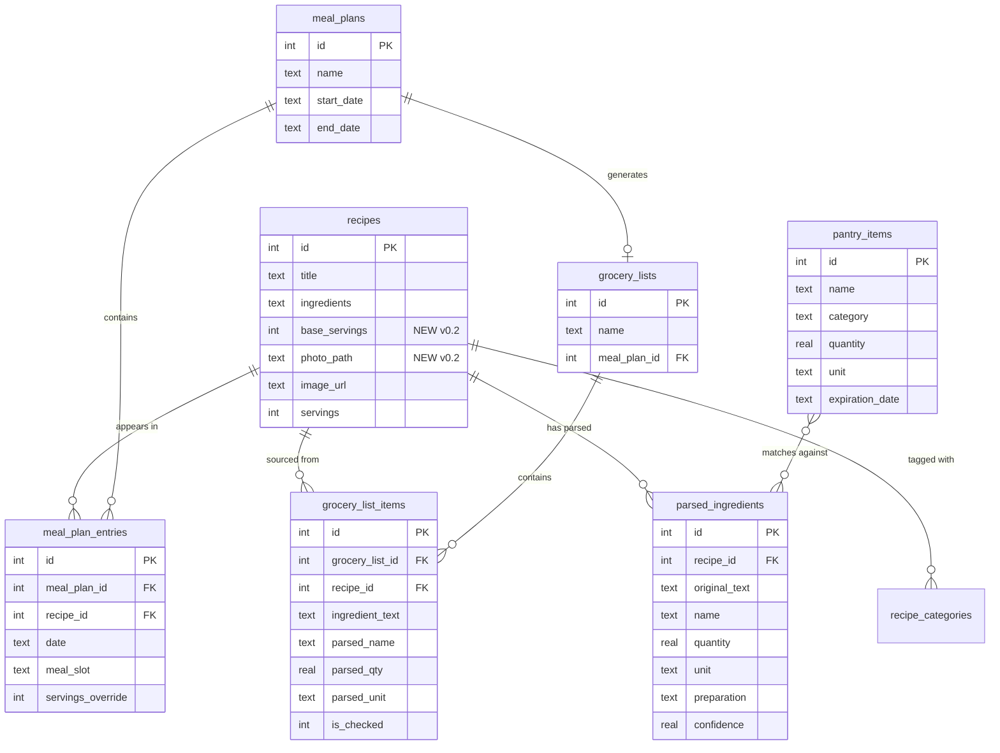

# Recipe App v0.2/v0.3 — htmx, Scaling, Meal Planner, Photos, OCR, Pantry

## Overview

Six features across two milestones that evolve the recipe app from a basic CRUD/search tool into a full cooking companion with interactive UI, smart scaling, meal planning, photo management, OCR import, and pantry-based recipe suggestions. The v0.1 foundation (1,756 recipes, FTS5 search, MCP server with 8 tools, FastAPI + Jinja2 + SQLite) is solid — these features build on it.

**v0.2 (this release):** htmx interactivity, recipe scaling, grocery list + meal planner, local photo storage
**v0.3 (next release):** OCR scanning, pantry tracking + "What can I make?"

## Problem Statement / Motivation

The v0.1 app replaced Paprika 3's core recipe management but left significant gaps in the cooking workflow: no way to scale recipes, no meal planning, no grocery lists, full-page reloads for every interaction, and all images are external URLs that can go stale. The Chef agent has a meal-planner cron skill but no database tables to persist plans or generate shopping lists.

Paprika 3 has: ingredient scaling, cooking mode with strikethrough, meal planner, grocery list, and pantry. We need parity plus agent-native additions (MCP tools for every feature so Chef can use them).

## Technical Approach

### Architecture (v0.2 Evolution)

```
┌─────────────┐     stdio      ┌──────────────┐
│  Spacebot   │────────────────│  MCP Server  │
│  Chef Agent │                │  (fastmcp)   │──┐
└─────────────┘                │  27 tools    │  │
                               └──────────────┘  │  imports
┌─────────────┐     HTTP                          ▼
│  OpenClaw   │────────────────┐          ┌──────────────┐
│             │                │          │  Shared DB   │
└─────────────┘                │          │  Module      │
                               │          │  (db.py)     │──── /root/recipes/data/recipes.db
┌─────────────┐     HTTP       ▼          └──────────────┘
│  Browser    │──── http://localhost:8420 ──┐  ▲        ┌──────────────┐
│  (htmx)     │                            │  │        │  data/photos │
└─────────────┘                     ┌──────┴──┴─────┐  │  originals/  │
                                    │   FastAPI     │──│  thumbnails/ │
                                    │   + partials  │  └──────────────┘
                                    └───────────────┘
```

**Key changes from v0.1:**
- MCP server grows from 8 to 27 tools (split into modules)
- htmx replaces full-page reloads for search, editing, cooking mode
- Jinja2 templates gain partial fragments for htmx responses
- New `data/photos/` directory for local image storage
- 5 new database tables + 2 new columns on `recipes`
- Schema versioning via `PRAGMA user_version`

### New Dependencies

| Package | Version | Purpose | Feature |
|---|---|---|---|
| htmx.min.js | 2.0.4 | Frontend interactivity (vendored in static/) | 4 |
| ingredient-parser-nlp | 2.6.0 | Parse "2 cups flour" → {qty, unit, item} | 5, 6, 9 |
| Pillow | >=12.0 | Photo thumbnail generation, EXIF handling | 7, 8 |
| rapidfuzz | >=3.0 | Fuzzy ingredient name matching | 9 |
| pint | >=0.24 | Unit conversion (cups↔ml, oz↔g) | 5 |

**Already present:** python-multipart (via fastapi[standard]), aiosqlite, jinja2, httpx, bleach.

### Database Schema Changes

#### New Columns on `recipes`

```sql
ALTER TABLE recipes ADD COLUMN base_servings INTEGER DEFAULT NULL;
ALTER TABLE recipes ADD COLUMN photo_path TEXT DEFAULT NULL;
```

#### New Tables

```sql
-- Schema versioning
-- Using PRAGMA user_version instead of a table

-- Parsed ingredients (denormalized from JSON for scaling + matching)
CREATE TABLE IF NOT EXISTS parsed_ingredients (
    id INTEGER PRIMARY KEY AUTOINCREMENT,
    recipe_id INTEGER NOT NULL REFERENCES recipes(id) ON DELETE CASCADE,
    original_text TEXT NOT NULL,
    name TEXT,
    quantity REAL,
    quantity_max REAL,
    unit TEXT,
    preparation TEXT,
    confidence REAL,
    sort_order INTEGER NOT NULL DEFAULT 0,
    created_at TEXT NOT NULL DEFAULT (datetime('now'))
);
CREATE INDEX IF NOT EXISTS idx_parsed_ingredients_recipe ON parsed_ingredients(recipe_id);
CREATE INDEX IF NOT EXISTS idx_parsed_ingredients_name ON parsed_ingredients(name);

-- Meal plans
CREATE TABLE IF NOT EXISTS meal_plans (
    id INTEGER PRIMARY KEY AUTOINCREMENT,
    name TEXT NOT NULL,
    start_date TEXT,
    end_date TEXT,
    created_at TEXT NOT NULL DEFAULT (datetime('now')),
    updated_at TEXT NOT NULL DEFAULT (datetime('now'))
);

-- Meal plan entries (recipes assigned to days/slots)
CREATE TABLE IF NOT EXISTS meal_plan_entries (
    id INTEGER PRIMARY KEY AUTOINCREMENT,
    meal_plan_id INTEGER NOT NULL REFERENCES meal_plans(id) ON DELETE CASCADE,
    recipe_id INTEGER NOT NULL REFERENCES recipes(id) ON DELETE CASCADE,
    date TEXT NOT NULL,
    meal_slot TEXT NOT NULL CHECK (meal_slot IN ('breakfast', 'lunch', 'dinner', 'snack')),
    servings_override INTEGER,
    created_at TEXT NOT NULL DEFAULT (datetime('now'))
);
CREATE INDEX IF NOT EXISTS idx_meal_plan_entries_plan ON meal_plan_entries(meal_plan_id);

-- Grocery lists
CREATE TABLE IF NOT EXISTS grocery_lists (
    id INTEGER PRIMARY KEY AUTOINCREMENT,
    name TEXT NOT NULL,
    meal_plan_id INTEGER REFERENCES meal_plans(id) ON DELETE SET NULL,
    created_at TEXT NOT NULL DEFAULT (datetime('now')),
    updated_at TEXT NOT NULL DEFAULT (datetime('now'))
);

-- Grocery list items
CREATE TABLE IF NOT EXISTS grocery_list_items (
    id INTEGER PRIMARY KEY AUTOINCREMENT,
    grocery_list_id INTEGER NOT NULL REFERENCES grocery_lists(id) ON DELETE CASCADE,
    recipe_id INTEGER REFERENCES recipes(id) ON DELETE SET NULL,
    ingredient_text TEXT NOT NULL,
    parsed_name TEXT,
    parsed_qty REAL,
    parsed_unit TEXT,
    is_checked INTEGER NOT NULL DEFAULT 0,
    sort_order INTEGER NOT NULL DEFAULT 0,
    created_at TEXT NOT NULL DEFAULT (datetime('now'))
);
CREATE INDEX IF NOT EXISTS idx_grocery_list_items_list ON grocery_list_items(grocery_list_id);

-- Pantry items (v0.3)
CREATE TABLE IF NOT EXISTS pantry_items (
    id INTEGER PRIMARY KEY AUTOINCREMENT,
    name TEXT NOT NULL,
    category TEXT,
    quantity REAL,
    unit TEXT,
    expiration_date TEXT,
    created_at TEXT NOT NULL DEFAULT (datetime('now')),
    updated_at TEXT NOT NULL DEFAULT (datetime('now'))
);
CREATE INDEX IF NOT EXISTS idx_pantry_items_name ON pantry_items(name);
```

#### Schema Migration Strategy

Use SQLite's built-in `PRAGMA user_version` for versioning. On app startup, check the version and apply pending migrations:

```python
async def run_migrations(db: aiosqlite.Connection):
    version = (await (await db.execute("PRAGMA user_version")).fetchone())[0]

    if version < 1:
        # v0.2 migrations
        await db.executescript("""
            ALTER TABLE recipes ADD COLUMN base_servings INTEGER DEFAULT NULL;
            ALTER TABLE recipes ADD COLUMN photo_path TEXT DEFAULT NULL;
            -- CREATE TABLE statements for parsed_ingredients, meal_plans, etc.
        """)
        await db.execute("PRAGMA user_version = 1")
        await db.commit()

    if version < 2:
        # v0.3 migrations
        await db.executescript("""
            -- CREATE TABLE pantry_items ...
        """)
        await db.execute("PRAGMA user_version = 2")
        await db.commit()
```

#### ERD



### Implementation Phases

---

## Phase 1: Foundation — htmx + Schema Migration (Feature 4 + Infrastructure)

**Priority: Must ship first — all other features' UIs depend on htmx patterns.**

### 1a. htmx Setup

- [ ] Download htmx 2.0.4 and vendor into `/root/recipes/static/htmx.min.js`
- [ ] Add `<script src="/static/htmx.min.js"></script>` to `templates/base.html`
- [ ] Move inline JS from `templates/recipes.html` (lines 98-117) and `templates/recipe_form.html` (lines 145-175) to `/root/recipes/static/app.js`
- [ ] Update CSP middleware in `main.py` — no changes needed since htmx is self-hosted and `script-src 'self'` already covers it, but verify inline scripts are eliminated
- [ ] Add `HX-Request` header detection helper to routes:
  ```python
  hx_request: Annotated[str | None, Header()] = None
  ```

### 1b. Partial Templates

Create a `templates/partials/` directory with HTML fragments:

- [ ] `partials/recipe_grid.html` — the recipe card grid (extracted from `recipes.html`)
- [ ] `partials/recipe_card.html` — single recipe card
- [ ] `partials/search_results.html` — search results wrapper
- [ ] `partials/ingredient_list.html` — ingredient list for detail page
- [ ] `partials/recipe_field.html` — single editable field (click-to-edit pattern)

### 1c. Live Search-as-You-Type

- [ ] Add `hx-get="/search" hx-trigger="input changed delay:300ms, keyup[key=='Enter']" hx-target="#recipe-grid" hx-indicator=".search-indicator"` to the search input in `recipes.html`
- [ ] Add `hx-get` triggers to category dropdown and sort selector
- [ ] Modify `home()` route in `main.py` to return partial `recipe_grid.html` when `HX-Request` header is present
- [ ] Add `hx-boost="true"` to `<body>` in `base.html` for zero-effort progressive enhancement on all navigation links

### 1d. Inline Editing on Recipe Detail

- [ ] Create click-to-edit pattern for each editable field on `recipe_detail.html`:
  - Title, description, notes — text/textarea inputs
  - Prep time, cook time, servings, rating, difficulty, cuisine — specialized inputs
  - Categories — comma-separated input with current values
- [ ] Add `GET /recipe/{id}/edit/{field}` route → returns edit form partial
- [ ] Add `PUT /recipe/{id}/field/{field}` route → validates, updates via existing db functions, returns display partial
- [ ] Ingredients and directions use the existing full edit form (too complex for inline)

### 1e. Cooking Mode with Ingredient Strikethrough

- [ ] Add "Start Cooking" button to `recipe_detail.html`
- [ ] Cooking mode UI: larger font, each ingredient gets `hx-post="/recipe/{id}/toggle-ingredient/{index}"` or purely client-side CSS toggle
- [ ] **Decision: client-side only** — use a small JS snippet in `app.js` that toggles a `strikethrough` class and persists to `localStorage` keyed by recipe ID. No server round-trip needed.
- [ ] Add direction step highlighting (click current step to advance)
- [ ] "Done Cooking" button clears localStorage state

### 1f. Schema Migration Infrastructure

- [ ] Implement `run_migrations()` using `PRAGMA user_version` in `db.py`
- [ ] Call `run_migrations()` from the FastAPI lifespan after `init_schema()`
- [ ] Migration v1: add `base_servings INTEGER` and `photo_path TEXT` columns to `recipes`
- [ ] Migration v1: create `parsed_ingredients`, `meal_plans`, `meal_plan_entries`, `grocery_lists`, `grocery_list_items` tables
- [ ] Also update `schema.sql` to include all new tables for fresh installs

### 1g. Tests for Phase 1

- [ ] Test htmx partial responses (check `HX-Request` header handling)
- [ ] Test inline edit endpoints (PUT field, validation errors)
- [ ] Test schema migration from v0 → v1
- [ ] Test that existing pages still work without htmx (progressive enhancement)

---

## Phase 2: Recipe Scaling (Feature 5)

**Depends on: Phase 1 (schema migration for `base_servings`, htmx for UI)**

### 2a. Ingredient Parser Integration

- [ ] Add `ingredient-parser-nlp==2.6.0` and `pint>=0.24` to `pyproject.toml`
- [ ] Create `src/recipe_app/ingredient_parser.py` module:
  - `parse_ingredient(text: str) -> ParsedIngredient` — wraps `ingredient_parser.parse_ingredient()`
  - `parse_recipe_ingredients(ingredients: list[str]) -> list[ParsedIngredient]` — batch parse
  - Handle edge cases: no-space format ("2tablespoons"), empty strings, "to taste" items
  - Preprocess step: insert space between number and unit if missing (regex: `(\d)(tablespoons?|teaspoons?|cups?|oz|lb|ml|g|kg)` → `\1 \2`)
- [ ] Create `db.py` functions:
  - `save_parsed_ingredients(db, recipe_id, parsed_list)` — upsert to `parsed_ingredients` table
  - `get_parsed_ingredients(db, recipe_id) -> list[dict]` — fetch parsed data
- [ ] Parse ingredients on recipe view (lazy parse + cache):
  - When recipe detail is loaded and `parsed_ingredients` table has no rows for that recipe, parse and save
  - Subsequent loads use cached parsed data
- [ ] Background batch parse: management command or startup task to parse all 1,756 recipes' ingredients

### 2b. Scaling Logic

- [ ] Create `src/recipe_app/scaling.py` module:
  - `scale_ingredient(parsed: dict, factor: float) -> dict` — multiply quantity by factor
  - `format_quantity(value: float) -> str` — display as cooking fraction (1/4, 1/3, 1/2, 2/3, 3/4) using `fractions.Fraction.limit_denominator(8)`
  - Supported multipliers: 1/8, 1/4, 1/3, 1/2, 1, 1.5, 2, 3, 4, 6, 8
  - Items with no quantity (e.g., "salt to taste") pass through unchanged
- [ ] Unit conversion toggle (metric ↔ imperial):
  - Use `pint` for volume-to-volume (cups↔ml, tbsp↔ml, tsp↔ml) and weight-to-weight (oz↔g, lb↔kg)
  - Volume-to-weight conversions are **out of scope** (requires density data per ingredient)
  - Store preference in cookie or localStorage

### 2c. Scaling UI

- [ ] Add scaling widget to `recipe_detail.html`:
  - Display base servings (or "Set servings" prompt if NULL)
  - Multiplier buttons: ×1/2, ×1, ×2, ×3, ×4 (most common)
  - Custom multiplier input for other values
  - Metric/imperial toggle switch
- [ ] **Client-side scaling**: embed parsed ingredient data as JSON in a `<script>` tag or `data-` attributes on the ingredient list. JS in `app.js` handles the math for instant updates without server round-trips.
- [ ] When `base_servings` is NULL, show a prompt: "How many servings does this recipe make?" with an htmx PUT to set it

### 2d. MCP Tools for Scaling

- [ ] `set_base_servings(recipe_id: int, servings: int)` — update `base_servings` column
- [ ] `scale_recipe(recipe_id: int, multiplier: float)` — returns scaled ingredient list as text

### 2e. Tests for Phase 2

- [ ] Test ingredient parser against 50 real ingredients from the database (including no-space format)
- [ ] Test scaling math: fractions, whole numbers, ranges, "to taste" passthrough
- [ ] Test format_quantity: 0.5→"1/2", 0.333→"1/3", 0.25→"1/4", 3.0→"3"
- [ ] Test unit conversion: cups↔ml, oz↔g
- [ ] Test MCP tools: set_base_servings, scale_recipe

---

## Phase 3: Grocery List + Meal Planner (Feature 6)

**Depends on: Phase 1 (tables created), Phase 2 (ingredient parser for aggregation)**

### 3a. Meal Plan CRUD

- [ ] Add `db.py` functions:
  - `create_meal_plan(db, name, start_date, end_date) -> int`
  - `get_meal_plan(db, plan_id) -> dict` (with entries and recipe titles)
  - `list_meal_plans(db) -> list[dict]`
  - `delete_meal_plan(db, plan_id)`
  - `add_meal_plan_entry(db, plan_id, recipe_id, date, meal_slot, servings_override=None)`
  - `remove_meal_plan_entry(db, entry_id)`
- [ ] Add REST API routes in new `routers/meal_plans.py`:
  - `GET /api/meal-plans` — list
  - `POST /api/meal-plans` — create
  - `GET /api/meal-plans/{id}` — get with entries
  - `DELETE /api/meal-plans/{id}` — delete
  - `POST /api/meal-plans/{id}/entries` — add recipe
  - `DELETE /api/meal-plans/entries/{entry_id}` — remove recipe

### 3b. Meal Plan Web UI

- [ ] Create `templates/meal_plans.html` — list of meal plans with create form
- [ ] Create `templates/meal_plan_detail.html` — calendar/list view of a plan
  - Days as rows, meal slots as columns
  - Recipe cards in each slot (clickable to view recipe)
  - "Add recipe" button per slot → htmx search modal to find and add a recipe
  - Drag-and-drop reordering (htmx `hx-swap` on drop) — **deferred, use add/remove for v0.2**
- [ ] Create `partials/meal_plan_entry.html` — single entry for htmx add/remove
- [ ] Add "Meal Plans" to navbar in `base.html`
- [ ] Add web routes in `main.py`:
  - `GET /meal-plans` — list page
  - `GET /meal-plans/{id}` — detail page
  - `POST /meal-plans` — create (form submit)
  - `POST /meal-plans/{id}/add-recipe` — add recipe to plan (htmx)

### 3c. Grocery List Generation

- [ ] Add `db.py` functions:
  - `generate_grocery_list(db, plan_id=None, recipe_ids=None, name=None) -> int`
    - Collects all ingredients from the specified recipes or meal plan
    - Parses each ingredient (using cached `parsed_ingredients` or parsing on the fly)
    - Aggregates by parsed name + unit: sum quantities for matching items
    - Falls back to raw string listing for unparseable ingredients
    - Inserts into `grocery_lists` + `grocery_list_items`
  - `get_grocery_list(db, list_id) -> dict`
  - `list_grocery_lists(db) -> list[dict]`
  - `check_grocery_item(db, item_id, is_checked: bool)`
  - `add_grocery_item(db, list_id, item_text: str)` — ad-hoc items
  - `delete_grocery_list(db, list_id)`

### 3d. Grocery List Web UI

- [ ] Create `templates/grocery_lists.html` — list of grocery lists
- [ ] Create `templates/grocery_list_detail.html` — checkable shopping list
  - Items grouped by parsed name (alphabetical for v0.2; aisle grouping deferred to v0.3)
  - Checkbox per item → `hx-post` toggles `is_checked`
  - Checked items move to bottom with strikethrough
  - "Add item" text input at bottom → `hx-post` adds ad-hoc item
  - "Generate from meal plan" button on meal plan detail page
- [ ] Create `partials/grocery_item.html` — single item for htmx toggle
- [ ] Add "Grocery Lists" to navbar in `base.html`
- [ ] Add web routes:
  - `GET /grocery-lists` — list page
  - `GET /grocery-lists/{id}` — detail page
  - `POST /grocery-lists/generate` — generate from meal plan or recipe IDs
  - `POST /grocery-lists/{id}/check/{item_id}` — toggle check (htmx)
  - `POST /grocery-lists/{id}/add-item` — add ad-hoc item (htmx)

### 3e. MCP Tools for Meal Planning + Grocery

- [ ] `create_meal_plan(name, start_date, end_date)`
- [ ] `get_meal_plan(plan_id)`
- [ ] `list_meal_plans()`
- [ ] `add_recipe_to_meal_plan(plan_id, recipe_id, date, meal_slot, servings=None)`
- [ ] `remove_recipe_from_meal_plan(entry_id)`
- [ ] `generate_grocery_list(plan_id=None, recipe_ids=None, name=None)`
- [ ] `get_grocery_list(list_id)`
- [ ] `check_grocery_item(item_id, is_checked)`
- [ ] `add_grocery_item(list_id, item_text)`

**Integration with Chef's existing meal-planner cron skill:** The Chef agent's weekly cron currently delivers meal plans via Slack. With these new MCP tools, Chef can now persist plans to the database and generate grocery lists automatically. The cron workflow should be updated to call `create_meal_plan` + `add_recipe_to_meal_plan` + `generate_grocery_list` instead of (or in addition to) just formatting a Slack message.

### 3f. Tests for Phase 3

- [ ] Test meal plan CRUD (create, add entries, get, delete, cascade)
- [ ] Test grocery list generation from meal plan (aggregation, deduplication)
- [ ] Test grocery list generation from ad-hoc recipe list
- [ ] Test item check/uncheck
- [ ] Test unparseable ingredient fallback (raw string, no aggregation)
- [ ] Test MCP tools

---

## Phase 4: Local Photo Storage (Feature 7)

**Depends on: Phase 1 (schema migration for `photo_path`)**

### 4a. Photo Storage Infrastructure

- [ ] Add `Pillow>=12.0` to `pyproject.toml`
- [ ] Create `data/photos/originals/` and `data/photos/thumbnails/` directories
- [ ] Add `RECIPE_PHOTO_DIR` config setting (default: `data/photos`), add to `config.py`
- [ ] Mount static files: `app.mount("/photos", StaticFiles(directory=config.photo_dir), name="photos")`

### 4b. Upload Endpoint

- [ ] Create `POST /api/recipes/{id}/photo` endpoint:
  - Accept `UploadFile` (multipart form)
  - Validate content type: allow `image/jpeg`, `image/png`, `image/webp` only
  - Validate file size: reject if > `config.max_photo_size` (10MB)
  - Validate magic bytes (not just content-type header)
  - Generate UUID filename: `{uuid4().hex}.{ext}`
  - Save original to `data/photos/originals/{filename}`
  - Generate thumbnail (400x400 max, preserve aspect ratio) using Pillow:
    - `ImageOps.exif_transpose()` for phone photo rotation
    - `Image.thumbnail((400, 400))`
    - Save as JPEG with `quality=85, optimize=True`
    - Strip EXIF metadata from thumbnail
  - Update `recipes.photo_path` column with the filename
  - Set `Image.MAX_IMAGE_PIXELS = 50_000_000` to prevent decompression bombs
- [ ] Create `DELETE /api/recipes/{id}/photo` endpoint:
  - Remove files from both `originals/` and `thumbnails/`
  - Set `photo_path` to NULL

### 4c. Web UI Updates

- [ ] Update `templates/recipe_form.html`:
  - Add file upload input alongside existing `image_url` text field
  - "Upload Photo" dropzone or button
  - Preview before upload
- [ ] Update `templates/recipe_detail.html`:
  - Display logic: prefer `photo_path` (local) over `image_url` (external)
  - If local: ``
  - If external: existing ``
- [ ] Update `templates/recipes.html` card grid:
  - Fix line 42-43 `startswith('https')` check to also handle local photos
  - Show thumbnail in grid: `/photos/thumbnails/{photo_path}`
- [ ] Add `POST /recipe/{id}/upload-photo` web route for form-based upload (redirects back to recipe)

### 4d. MCP Tool

- [ ] `upload_recipe_photo(recipe_id: int, image_base64: str)` — accepts base64-encoded image data, decodes, validates, stores. Used by Chef agent for OCR workflow (Feature 8).

### 4e. Image Migration Script (Optional, Separate)

- [ ] Create `scripts/download_external_images.py`:
  - Iterates recipes with `image_url` but no `photo_path`
  - Downloads using `fetch_url_safely()` from `scraper.py` (SSRF protection) — **note:** must add image content-type support to `fetch_url_safely()` (currently only accepts `text/html`)
  - Saves locally, generates thumbnail, updates `photo_path`
  - Handles 404s, timeouts, non-image responses gracefully
  - Rate-limited (1 req/sec) to avoid hammering external servers
  - **Not blocking for v0.2 release** — run post-release as a background task

### 4f. Tests for Phase 4

- [ ] Test photo upload (valid JPEG, valid PNG, valid WebP)
- [ ] Test rejection: oversized file, SVG, executable, invalid content-type
- [ ] Test thumbnail generation (correct dimensions, EXIF rotation)
- [ ] Test photo deletion (files removed, column nulled)
- [ ] Test template display logic (local photo preferred over image_url)
- [ ] Test decompression bomb protection

---

## Phase 5: OCR Scanning (Feature 8) — v0.3

**Depends on: Phase 4 (photo upload infrastructure)**

### 5a. Vision API Integration

- [ ] Create `src/recipe_app/ocr.py` module:
  - **Primary: Claude Vision** (already available via the same Anthropic API key used by spacebot)
  - `async def extract_recipe_from_image(image_bytes: bytes) -> dict`:
    - Sends image to Claude Sonnet with structured extraction prompt
    - Prompt requests JSON output: `{title, description, ingredients[], directions[], servings, prep_time_minutes, cook_time_minutes, notes}`
    - Returns parsed dict
  - Fallback: if API fails, return error with suggestion to enter manually
- [ ] Add `RECIPE_ANTHROPIC_API_KEY` or reuse existing env var from spacebot config
- [ ] Extraction prompt should:
  - Handle both printed cookbook text and handwritten cards
  - Normalize abbreviations ("tsp" → "teaspoon", "c." → "cup")
  - Separate ingredients into individual list items
  - Number direction steps
  - Flag low-confidence extractions

### 5b. OCR Web UI Flow

- [ ] Add "Scan Recipe" button/link to navbar and `/add` page
- [ ] Create `templates/scan_recipe.html`:
  - Photo upload form (reuse photo upload component from Phase 4)
  - "Processing..." indicator while OCR runs
  - After extraction: pre-populate the recipe add form with extracted data
  - User reviews, corrects, and saves
- [ ] Add web routes:
  - `GET /scan` — scan page with upload form
  - `POST /scan` — upload photo, run OCR, redirect to `/add` with pre-filled fields
- [ ] The `/add` route should accept query parameters or session data to pre-fill fields

### 5c. MCP Tool

- [ ] `ocr_scan_recipe(image_base64: str) -> dict` — accepts base64 image, runs OCR, returns extracted fields. Chef agent can then call `create_recipe` with the result.

### 5d. Tests for Phase 5

- [ ] Test OCR extraction with a sample cookbook page image
- [ ] Test OCR extraction with a handwritten recipe card
- [ ] Test error handling: API timeout, invalid image, no recipe content detected
- [ ] Test the full flow: upload → extract → pre-fill form → save recipe
- [ ] Test MCP tool

---

## Phase 6: Pantry + "What Can I Make?" (Feature 9) — v0.3

**Depends on: Phase 2 (ingredient parser), Phase 1 (schema migration)**

### 6a. Pantry CRUD

- [ ] Add `db.py` functions:
  - `add_pantry_item(db, name, category=None, quantity=None, unit=None, expiration_date=None) -> int`
  - `update_pantry_item(db, item_id, **kwargs)`
  - `delete_pantry_item(db, item_id)`
  - `list_pantry_items(db) -> list[dict]`
  - `get_expiring_items(db, days_ahead: int = 3) -> list[dict]`
- [ ] Add REST API routes in new `routers/pantry.py`:
  - `GET /api/pantry` — list items
  - `POST /api/pantry` — add item
  - `PATCH /api/pantry/{id}` — update item
  - `DELETE /api/pantry/{id}` — delete item

### 6b. Pantry Web UI

- [ ] Create `templates/pantry.html`:
  - List of pantry items (name, quantity, unit, expiry indicator)
  - Quick-add text input at top: type name, press Enter → `hx-post` adds item
  - Edit/delete per item (htmx inline edit, same pattern as recipe fields)
  - Visual indicator for items expiring within 3 days (yellow/red highlight)
  - "What Can I Make?" button → navigates to results
- [ ] Add "Pantry" to navbar in `base.html`
- [ ] Add web routes:
  - `GET /pantry` — pantry page
  - `POST /pantry/add` — add item (htmx)
  - `POST /pantry/edit/{id}` — edit item (htmx)
  - `POST /pantry/delete/{id}` — delete item (htmx)

### 6c. "What Can I Make?" Matching Engine

- [ ] Create `src/recipe_app/pantry_matcher.py`:
  - `async def find_matching_recipes(db, max_missing: int = 2) -> list[dict]`:
    - Fetches all pantry item names
    - For each recipe, compares parsed ingredient names against pantry items
    - **Matching strategy (three-tier):**
      1. Exact match (case-insensitive, trimmed)
      2. Substring containment ("chicken" matches "boneless skinless chicken breast")
      3. Fuzzy match via `rapidfuzz.fuzz.partial_ratio` with score_cutoff=80
    - Returns recipes sorted by: (1) % ingredients available DESC, (2) missing count ASC
    - Each result includes: recipe summary, available ingredients, missing ingredients, match percentage
  - Performance: pre-compute an ingredient name index from `parsed_ingredients` table to avoid scanning all 1,756 recipes' raw text
- [ ] Add `rapidfuzz>=3.0` to `pyproject.toml`

### 6d. "What Can I Make?" Web UI

- [ ] Create `templates/pantry_matches.html`:
  - Filter: "Show recipes missing at most N ingredients" (slider: 0, 1, 2, 3, 5, any)
  - Recipe cards with match percentage badge
  - Each card shows: available ingredients (green checkmarks), missing ingredients (red X)
  - Click card → recipe detail page
- [ ] Add web route:
  - `GET /pantry/what-can-i-make` — matching results page
  - `GET /pantry/what-can-i-make` with `HX-Request` → partial results for htmx filtering

### 6e. MCP Tools for Pantry

- [ ] `add_pantry_item(name, category=None, quantity=None, unit=None, expiration_date=None)`
- [ ] `remove_pantry_item(item_id)`
- [ ] `list_pantry_items()`
- [ ] `update_pantry_item(item_id, name=None, quantity=None, unit=None, expiration_date=None)`
- [ ] `find_recipes_from_pantry(max_missing=2)` — the core query
- [ ] `get_expiring_items(days_ahead=3)` — for Chef cron proactive suggestions

**Integration with Chef agent:** Chef's cron can call `get_expiring_items(3)` to find items about to expire, then `find_recipes_from_pantry()` to suggest recipes that use them, and deliver suggestions via Slack: "Your chicken expires Thursday — here are 5 recipes you can make tonight."

### 6f. Paprika Parity Check

Paprika 3's pantry is actually minimal: a simple ingredient list with text-match recipe filtering. Our v0.3 implementation **exceeds Paprika parity** with:
- Quantity tracking (Paprika: no)
- Expiry dates (Paprika: no)
- Fuzzy matching (Paprika: exact text only)
- Match percentage ranking (Paprika: binary match/no-match)
- Agent-driven proactive suggestions (Paprika: no agent access)

### 6g. Tests for Phase 6

- [ ] Test pantry CRUD
- [ ] Test matching: exact match, substring match, fuzzy match
- [ ] Test ranking: recipes sorted by availability percentage
- [ ] Test max_missing filter
- [ ] Test with empty pantry (no matches)
- [ ] Test with full pantry (all recipes match)
- [ ] Test expiring items query
- [ ] Test MCP tools

---

## Alternative Approaches Considered

### Ingredient Parser

| Approach | Verdict |
|---|---|
| `ingredient-parser-nlp` (ML/CRF) | **Chosen** — 95% sentence accuracy, handles fractions, returns Fraction objects ideal for scaling |
| Custom regex | Fragile; fails on "2 1/2 cups", "one 14-oz can", "salt to taste". Would need constant maintenance. |
| LLM-based parsing per ingredient | Too slow and expensive for 1,756 recipes × ~10 ingredients each. Good for OCR output cleanup, not batch parsing. |
| `spaCy` custom NER | Requires labeling training data. ingredient-parser-nlp already did this with 81K sentences. |

**Preprocessing required:** The Paprika import data has no spaces between numbers and units ("2tablespoons"). A regex preprocessing step (`(\d)(tablespoons?|...)` → `\1 \2`) is needed before passing to the parser.

### Scaling Approach

| Approach | Verdict |
|---|---|
| Client-side JS with embedded JSON | **Chosen** — instant updates, no server round-trips, works with cooking mode |
| Server-side htmx per scale change | Too many requests for a slider/button interaction. Adds latency. |
| Pre-computed scaled variants in DB | Storage explosion. Not practical for arbitrary multipliers. |

### OCR Engine

| Approach | Verdict |
|---|---|
| Claude Vision (Sonnet) | **Chosen** — already in stack via spacebot, excellent at structured extraction, handles handwriting |
| pytesseract (local) | Poor handwriting support, requires Tesseract binary install, needs custom parsing after OCR |
| Google Cloud Vision | Good accuracy but adds a separate API key and billing account |

### Pantry Matching

| Approach | Verdict |
|---|---|
| Three-tier (exact + substring + rapidfuzz) | **Chosen** — good balance of accuracy and simplicity |
| Embedding-based semantic search | Overkill for ingredient matching. Requires a model. |
| LLM per recipe | Way too slow for 1,756 recipes on every query |
| FTS5 only | Misses fuzzy matches ("chicken" vs "chicken breast" works, but "flour" vs "all-purpose flour" is harder) |

## System-Wide Impact

### Interaction Graph

- **htmx requests** → FastAPI routes → check `HX-Request` header → return partial or full template
- **Scaling widget** (client-side) → no server interaction except initial parse + `set_base_servings`
- **Grocery list generation** → reads `parsed_ingredients` → aggregates → writes `grocery_list_items`
- **Photo upload** → FastAPI `UploadFile` → Pillow thumbnail → filesystem write → DB update
- **OCR** → photo upload → Anthropic API call → pre-fill recipe form → standard `create_recipe` flow
- **Pantry matching** → reads `pantry_items` + `parsed_ingredients` → in-memory matching → returns ranked results

### Error Propagation

- **Ingredient parser failures**: gracefully degrade — unparseable ingredients display as-is, scaling disabled for that item, grocery list includes raw text
- **Photo upload failures**: HTTP 413 (too large), 415 (wrong type), 500 (disk full) — all surfaced in UI with htmx error handling
- **OCR API timeout**: show "Extraction failed, please try again or enter manually" — redirect to standard add form
- **Pantry fuzzy match false positives**: acceptable — user sees suggested recipes and uses judgment

### State Lifecycle Risks

- **Partial grocery list generation**: if aggregation fails mid-way, could leave partial items. Wrap in transaction.
- **Photo upload + DB update**: if DB update fails after file write, orphaned file on disk. Mitigation: write file last, or cleanup on error.
- **Schema migration**: if `ALTER TABLE` succeeds but subsequent `CREATE TABLE` fails, `user_version` is not incremented, so next startup retries. The `ALTER TABLE` will fail with "duplicate column" — needs `try/except` handling.

### API Surface Parity

All new features get both Web UI routes AND MCP tools, ensuring agent-native parity:

| Feature | Web Routes | MCP Tools |
|---|---|---|
| Scaling | UI-only (client-side JS) | `set_base_servings`, `scale_recipe` |
| Meal Plans | 6 routes | 5 tools |
| Grocery Lists | 5 routes | 4 tools |
| Photos | 3 routes | 1 tool |
| OCR | 2 routes | 1 tool |
| Pantry | 5 routes | 6 tools |
| **Total new** | **21 routes** | **19 tools** |

### MCP Server Restructuring

The MCP server grows from 8 to 27 tools. Split into modules:

```
src/recipe_app/
  mcp_server.py          → mcp_server.py (entry point, registers all tools)
  mcp_tools/
    __init__.py
    recipes.py            # Existing 8 recipe tools
    scaling.py            # set_base_servings, scale_recipe
    meal_plans.py         # 5 meal plan tools
    grocery.py            # 4 grocery list tools
    photos.py             # upload_recipe_photo
    ocr.py                # ocr_scan_recipe
    pantry.py             # 6 pantry tools
```

## Acceptance Criteria

### Functional Requirements

- [ ] **htmx**: Search results update without page reload within 300ms of typing pause
- [ ] **htmx**: Recipe fields can be edited inline on the detail page
- [ ] **htmx**: Cooking mode allows ingredient strikethrough with state persisted in localStorage
- [ ] **Scaling**: Ingredients scale correctly for multipliers 1/8x through 8x
- [ ] **Scaling**: Quantities display as cooking fractions (1/4, 1/3, 1/2, 2/3, 3/4)
- [ ] **Scaling**: "To taste" and unparseable ingredients pass through unchanged
- [ ] **Meal Plan**: Create, view, and manage meal plans with recipes in day/slot grid
- [ ] **Grocery List**: Generate aggregated grocery list from meal plan or recipe selection
- [ ] **Grocery List**: Check off items with persistent state
- [ ] **Photos**: Upload JPEG/PNG/WebP photos up to 10MB per recipe
- [ ] **Photos**: Thumbnails auto-generated at 400x400 max
- [ ] **Photos**: Local photos display in grid and detail views
- [ ] **OCR** (v0.3): Photograph a cookbook page and extract recipe fields
- [ ] **Pantry** (v0.3): Add/manage pantry items
- [ ] **Pantry** (v0.3): "What can I make?" returns recipes ranked by ingredient availability

### Non-Functional Requirements

- [ ] All new features have MCP tool equivalents (agent-native parity)
- [ ] No regression in existing search, CRUD, or import functionality
- [ ] htmx operates with progressive enhancement — app still works without JS
- [ ] Photo uploads enforce content-type + magic byte validation (security)
- [ ] CSP headers maintained — no inline scripts, htmx self-hosted
- [ ] Existing 7 test files pass; new tests added per phase

### Quality Gates

- [ ] All existing tests pass (`pytest`)
- [ ] New tests added for each phase (target: 80%+ coverage of new code)
- [ ] No new security warnings (SSRF, XSS, path traversal)
- [ ] Schema migration tested: fresh install AND upgrade from v0.1

## Success Metrics

- **htmx**: Search interaction feels instantaneous (< 200ms perceived latency)
- **Scaling**: > 90% of ingredients parse correctly from the existing 1,756 recipes
- **Grocery List**: Ingredient aggregation correctly combines > 80% of duplicates
- **Photos**: Upload-to-display cycle < 3 seconds
- **OCR**: > 85% accuracy on printed cookbook pages (measured by field correctness)
- **Pantry**: "What can I make?" returns relevant results with < 500ms query time

## Dependencies & Prerequisites

- **ingredient-parser-nlp 2.6.0** — requires Python >= 3.11 (we have 3.12, OK)
- **Pillow >= 12.0** — requires system libraries (libjpeg, libpng) — verify installed on server
- **Anthropic API key** — needed for OCR (v0.3). Check if spacebot's key can be reused.
- **htmx 2.0.4** — download and vendor, no Python dependency
- **rapidfuzz >= 3.0** — C++ extension, may need build tools

## Risk Analysis & Mitigation

| Risk | Impact | Likelihood | Mitigation |
|---|---|---|---|
| Ingredient parser fails on no-space format | Scaling broken for most recipes | High | Preprocessing regex to insert spaces before parsing |
| 1,756 recipes have no base_servings | Scaling widget unusable | Certain | Allow NULL → show "set servings" prompt; Chef batch-fills |
| Pillow not installed / missing libs | Photo upload fails | Low | Add to pyproject.toml, test in CI |
| htmx CDN blocked by CSP | No interactivity | None (vendoring) | Self-host in static/ — already planned |
| Anthropic API rate limits for OCR | OCR slow or unavailable | Low | Rate limit on our end; fallback to manual entry |
| SQLite write contention with 27 MCP tools | Timeouts under load | Low (single-user) | WAL mode + busy_timeout=5000 already set |

## Future Considerations (v0.4+)

- **Subcategories** — nested category tree
- **Soft delete / trash** — recoverable deletion with 30-day cleanup
- **Recipe-to-recipe links** — `[recipe:Chicken Stock]` syntax in directions
- **Timer detection** — parse "bake for 25 minutes" into tappable timers
- **Photo embedding in directions** — step-by-step photo guide
- **Pantry deduction after cooking** — auto-reduce quantities
- **Grocery list aisle grouping** — organize by store department
- **Multi-user auth** — if the app ever needs to support more than one person
- **Paprika format import** — `.paprikarecipes` file support
- **Wake Lock API** — keep screen on during cooking mode (mobile)

## Sources & References

### Origin

- **v0.1 Plan:** [/root/docs/plans/2026-03-24-001-feat-recipe-app-paprika-replacement-plan.md] — foundation architecture, Paprika feature audit, tech stack decisions

### Internal References

- Architecture: `/root/recipes/src/recipe_app/main.py` — FastAPI app, CSP middleware (line 38), web routes
- Database: `/root/recipes/src/recipe_app/db.py` — all CRUD operations, FTS5 search
- Schema: `/root/recipes/src/recipe_app/sql/schema.sql` — current DDL
- Models: `/root/recipes/src/recipe_app/models.py` — Pydantic models, `servings` is `str | None`
- MCP server: `/root/recipes/src/recipe_app/mcp_server.py` — 8 current tools
- Config: `/root/recipes/src/recipe_app/config.py` — `max_photo_size=10MB` already defined
- Scraper: `/root/recipes/src/recipe_app/scraper.py` — `fetch_url_safely()`, `sanitize_fts5_query()`
- Templates: `/root/recipes/src/recipe_app/templates/` — 4 Jinja2 files
- Security hardening: `/root/docs/solutions/security-issues/fastapi-ssrf-xss-csp-hardening.md`
- MCP integration spec: `/root/spacebot/docs/design-docs/recipe-app-mcp-integration.md`
- Chef cron workflow: `/root/docs/solutions/integration-issues/cron-workflow-setup-credentials-slack-delivery.md`

### External References

- htmx docs: https://htmx.org/docs/
- ingredient-parser-nlp: https://pypi.org/project/ingredient-parser-nlp/ (v2.6.0, 95% accuracy)
- Pillow thumbnail docs: https://pillow.readthedocs.io/en/stable/handbook/tutorial.html
- FastAPI file uploads: https://fastapi.tiangolo.com/tutorial/request-files/
- rapidfuzz: https://github.com/rapidfuzz/RapidFuzz
- pint unit conversion: https://pint.readthedocs.io/
- Claude Vision: https://docs.anthropic.com/en/docs/build-with-claude/vision
