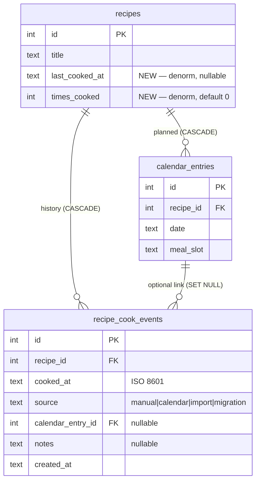

# feat: Last-cooked history + freshness signals

> **For Hermes:** Use subagent-driven-development skill to implement this plan task-by-task.

**Goal.** Add an explicit, trustworthy notion of “last cooked” so recipe recommendations can prefer new recipes, surface overdue favorites, and stop guessing from ratings/notes alone.

**Focusing question.** *What's the ONE thing such that doing it makes the rest easier or unnecessary?* — Ship the `recipe_cook_events` table + the `record_recipe_cooked` DB helper. Every downstream surface (REST, MCP, UI, sort, recommendations) composes trivially once that pair exists.

**Architecture.** Treat **planned** meals and **actually cooked** meals as different concepts. Keep an append-only cook-history table as the source of truth. Denormalize the latest timestamp and the running count onto `recipes` so search/sort/recommendation reads stay cheap.

**Tech stack.** FastAPI, aiosqlite, Pydantic, HTMX/Jinja, FastMCP, SQLite `PRAGMA user_version` migrations.

**Leading vs lagging.** Ratings and favorites are lagging — they describe opinion formed in the past. `last_cooked_at` is leading for the "what should I cook next?" question: it bounds a recipe's candidacy *before* a recommendation is made, not after.

---

## Why this needs a real schema change

Today the app can tell us:
- what a recipe is
- how it was rated
- whether it is a favorite
- whether it was scheduled on the calendar

But it **cannot tell us whether it was actually cooked**, or when. That gap matters because Grandin's target recommendation is not "show me recipes with high ratings." It is closer to:

- "show me new recipes I'll probably like"
- "also allow old favorites that feel due again"
- "do not over-repeat things I just made last week"

`calendar_entries` is not enough, because **scheduled ≠ cooked**. If we overload the calendar table, the app will quietly lie.

## Chosen direction

### 1. Source of truth: append-only cook events

New table `recipe_cook_events`:

```sql
CREATE TABLE IF NOT EXISTS recipe_cook_events (
    id INTEGER PRIMARY KEY AUTOINCREMENT,
    recipe_id INTEGER NOT NULL REFERENCES recipes(id) ON DELETE CASCADE,
    cooked_at TEXT NOT NULL,
    source TEXT NOT NULL DEFAULT 'manual'
        CHECK(source IN ('manual', 'calendar', 'import', 'migration')),
    calendar_entry_id INTEGER REFERENCES calendar_entries(id) ON DELETE SET NULL,
    notes TEXT,
    created_at TEXT NOT NULL DEFAULT (datetime('now'))
);

CREATE INDEX IF NOT EXISTS idx_cook_events_recipe_time
    ON recipe_cook_events(recipe_id, cooked_at DESC);
CREATE INDEX IF NOT EXISTS idx_cook_events_cooked_at
    ON recipe_cook_events(cooked_at DESC);
```

### 2. Fast-read denormalized fields on `recipes`

```sql
ALTER TABLE recipes ADD COLUMN last_cooked_at TEXT DEFAULT NULL;
ALTER TABLE recipes ADD COLUMN times_cooked INTEGER NOT NULL DEFAULT 0
    CHECK(times_cooked >= 0);
```

Why both layers:

- `recipe_cook_events` preserves history and leaves future options open.
- `recipes.last_cooked_at` and `recipes.times_cooked` make list/search/recommendation reads O(1) per recipe instead of correlated subqueries.
- Grandin's "what can I make?" screen needs to stay fast as the history grows.

### 3. Semantic rule

- **Calendar entry** = plan / intention
- **Cook event** = actual cooking happened
- A recipe can be marked cooked without a calendar entry
- A calendar entry does **not** automatically imply cooked

That separation is the core product decision in this plan. Every downstream design falls out of it.

### 4. Entity relationships



## Alternatives considered and rejected

### Option A — only add `recipes.last_cooked_at`

Rejected: loses history on day one.

- No audit trail.
- Cannot answer "how often do I make this?"
- No future support for "show me the last 5 times I made this."
- Brittle if the user misclicks and wants to undo.

### Option B — reuse `calendar_entries`

Rejected: conflates planning with execution.

- Historical calendar data would be misread as actual cooks.
- Skipped meals become false positives.
- Recommendation freshness becomes polluted by aspirational planning.

### Option C — add a boolean `cooked` column to `calendar_entries`

Rejected: only captures cooks that were *planned first*. Grandin often cooks unplanned, and a calendar-free cook event has nowhere to live.

## Migration (v4 → v5)

### Shape

Idempotent `ADD COLUMN` + `CREATE TABLE IF NOT EXISTS` — no table recreations, no FK drops. Simpler than the v3→v4 restructure. Follow the v1/v2/v3 patterns, not the v4 pattern.

### Steps (implemented in `src/recipe_app/db.py` after the v4 block, before line 427)

1. Back up the DB via `VACUUM INTO` (with single-quote escaping) → fallback to `shutil.copy2`. Same defensive pattern as v3/v4.
2. Guard each column addition with `_column_exists(db, "recipes", "...")` — `ALTER TABLE ADD COLUMN` on an existing column hard-fails.
3. `CREATE TABLE IF NOT EXISTS recipe_cook_events (…)`.
4. `CREATE INDEX IF NOT EXISTS` for the two supporting indexes.
5. `PRAGMA foreign_key_check` — must fetch results and raise on violations (v4 learning).
6. `PRAGMA user_version = 5`; `await db.commit()`.

### Schema.sql parity (critical — from v4 learning)

`init_schema()` runs `schema.sql` via `executescript` on every startup, **before** `run_migrations()`. If `schema.sql` still reports `user_version = 4` after a migration lands, the migration re-runs on every restart — silent data loss risk.

**Action:** in the same PR as the v5 migration block, update `src/recipe_app/sql/schema.sql`:

- Add `last_cooked_at` / `times_cooked` to the `recipes` CREATE TABLE block.
- Append the `recipe_cook_events` CREATE TABLE block.
- Append the two new indexes.
- Change the trailing `PRAGMA user_version = 4` → `5`.

### Backfill policy

**Do not automatically backfill cook history from existing calendar entries in v1.** That would create fake confidence from plan data.

v1 behavior:

- Existing recipes start with `last_cooked_at = NULL`, `times_cooked = 0`.
- Cook history accumulates only from explicit user/agent actions going forward.
- If a backfill is ever desired, it must be a separate explicit one-shot tool with user approval and a `source='migration'` tag.

## Data-layer API

### New helpers in `src/recipe_app/db.py`

- `record_recipe_cooked(db, recipe_id, cooked_at=None, source='manual', calendar_entry_id=None, notes=None) -> dict`
- `list_recipe_cook_events(db, recipe_id, limit=20) -> list[dict]`
- `delete_recipe_cook_event(db, event_id) -> bool` *(v1, see Open Questions resolution)*

### Transaction shape of `record_recipe_cooked`

All three writes happen inside a single transaction held under `_write_lock` to prevent torn state:

1. `INSERT INTO recipe_cook_events (…) VALUES (…)`.
2. `UPDATE recipes SET last_cooked_at = (SELECT MAX(cooked_at) FROM recipe_cook_events WHERE recipe_id = ?), times_cooked = (SELECT COUNT(*) FROM recipe_cook_events WHERE recipe_id = ?) WHERE id = ?`.
3. Return the updated recipe dict (re-fetched after the update so the caller sees consistent state).

**Why recompute instead of increment?** Increment is cheaper but drifts if `delete_recipe_cook_event` lands. Recompute is always correct. At the row counts Grandin will ever hit, the cost is noise.

### Defaults

- `cooked_at` omitted → use `datetime('now')` (UTC, ISO 8601).
- `source` omitted → `'manual'`.
- `calendar_entry_id` omitted → NULL.

## REST API

Add to `src/recipe_app/routers/recipes.py`:

- `POST /api/recipes/{recipe_id}/cooked` → body `RecipeCookEventCreate`, returns `RecipeCookEventResponse` and the updated recipe.
- `GET /api/recipes/{recipe_id}/cook-events?limit=20` → returns `list[RecipeCookEventResponse]`, newest first.
- `DELETE /api/recipes/cook-events/{event_id}` → returns 204 on success. *(Correction path, no UI in v1.)*

Suggested POST body:

```json
{
  "cooked_at": "2026-04-18T18:30:00",
  "source": "manual",
  "calendar_entry_id": 123,
  "notes": "Made for dinner; turned out great"
}
```

## MCP tools

Add to `src/recipe_app/mcp_server.py` (these must land **atomically with the DB changes** per workflow preference):

- `record_recipe_cooked(recipe_id, cooked_at=None, source='manual', calendar_entry_id=None, notes=None)` — matches the REST contract.
- `get_recipe_cook_history(recipe_id, limit=10)` — list cook events newest-first.
- `delete_recipe_cook_event(event_id)` — correction path for agent flows.

This is the surface Hermes needs for meal-planning intelligence. Without it, an agent can tell you what to cook but cannot observe what you actually cooked.

## Pydantic models (`src/recipe_app/models.py`)

- Add `last_cooked_at: datetime | None = None` to `RecipeResponse`.
- Add `times_cooked: int = 0` to `RecipeResponse`.
- New models:

  ```python
  class RecipeCookEventCreate(BaseModel):
      cooked_at: datetime | None = None
      source: Literal["manual", "calendar", "import", "migration"] = "manual"
      calendar_entry_id: int | None = None
      notes: str | None = None

  class RecipeCookEventResponse(BaseModel):
      id: int
      recipe_id: int
      cooked_at: datetime
      source: str
      calendar_entry_id: int | None = None
      notes: str | None = None
      created_at: datetime
  ```

- Extend the `sort` literal on `SearchParams` (models.py:80) to include `"last_cooked"`.

## Web UI

### Recipe detail page (`src/recipe_app/templates/recipe_detail.html`)

Two additions, both targeted at the existing header chrome so we don't invent new layout primitives:

1. **Freshness line** — new `<div class="recipe-detail-meta-item">` in the meta row (alongside the ⏱️ / 🍽️ / 👥 items at lines 32–43):

   - `times_cooked == 0` → "Never cooked"
   - `times_cooked > 0` → "Last cooked {{ humanize }}" (e.g. "12 days ago", "yesterday", "today")
   - Optionally append "· {{ times_cooked }}×" when count > 1 — decide during implementation; don't over-design copy.

2. **`Mark Cooked` button** — new button in `recipe-detail-actions` (after line 48, next to `Start Cooking`). Uses the same HTMX pattern as `favorite_toggle`:

   ```html
   <form method="post" action="/recipe/{{ recipe.id }}/cooked"
         hx-post="/recipe/{{ recipe.id }}/cooked"
         hx-target="#rating-widget"
         hx-swap="none"
         class="inline-form">
     <button type="submit" class="btn btn-secondary">Mark Cooked</button>
   </form>
   ```

   Requires a matching web route in `src/recipe_app/main.py` that delegates to `record_recipe_cooked` and returns a header-fragment response so the freshness line updates in place (HTMX fragment pattern already used for favorites).

### Calendar page (`src/recipe_app/templates/calendar.html`)

Optional but worth doing in the same feature: per-card `Cooked` affordance that POSTs with `source='calendar'` and `calendar_entry_id=<entry>`.

**Invariant:** marking a calendar card cooked creates a cook event. It **must not** mutate the calendar row. The calendar entry remains a plan; the cook event records the outcome.

## Search / discovery hooks

### Minimum v1

- `models.py:80` and `routers/search.py:18` — extend the sort `Literal` to include `"last_cooked"`. (Same enum is duplicated in both places; both must change together.)
- `search_recipes` in `db.py` — extend the sort-column allowlist mapping to handle `last_cooked` → `ORDER BY recipes.last_cooked_at IS NULL, recipes.last_cooked_at DESC` (NULLs last so "never cooked" doesn't dominate the top of a "recent cooks" sort).
- Default recipe payloads already expose `last_cooked_at` because it rides on `RecipeResponse`.

### Later (out of scope for v1, noted for context)

Filter semantics like `never_cooked`, `cooked_before=DATE`, `not_cooked_since=DATE`. These compose cleanly once the base field exists; ship them when a concrete use-case asks for them.

### Recommendation behavior this unlocks

Once the field exists, planner logic can rank like:

1. Never cooked + strong taste match → top.
2. Highly rated/favorited but stale (`last_cooked_at` old or null) → middle.
3. Avoid recipes cooked in the last N days unless explicitly requested.

That is the product payoff. The recommendation code itself is deliberately **not** part of this plan.

## System-wide impact

### Interaction graph

```
POST /api/recipes/{id}/cooked
  → record_recipe_cooked(db, …)
    → _write_lock.acquire()
      → BEGIN
        → INSERT recipe_cook_events
        → UPDATE recipes SET last_cooked_at=…, times_cooked=…
        → SELECT updated recipe
      → COMMIT
    → _write_lock.release()
  → serialize to RecipeCookEventResponse + RecipeResponse

MCP record_recipe_cooked(…)
  → same record_recipe_cooked(db, …) helper
  → identical transaction, identical return shape

UI "Mark Cooked" form submit
  → POST /recipe/{id}/cooked (web route, not /api)
  → record_recipe_cooked(…)
  → returns Jinja fragment → HTMX swaps freshness line in place
```

Key callbacks to trace during implementation:

- `recipes_update_timestamp` trigger fires on the denorm `UPDATE`, bumping `recipes.updated_at`. This is acceptable: cooking a recipe *is* a meaningful recipe-touch event.
- FTS5 index: `recipes_fts` is maintained manually in `db.py` (no triggers). Since we're not adding cook-event text to FTS, no FTS churn.

### Error & failure propagation

- `SQLITE_BUSY` → serialized via `_write_lock` + `PRAGMA busy_timeout=5000`. Already handled app-wide.
- `FK violation` on `recipe_id` (recipe deleted between validation and insert) → surface as 404. Add a pre-check `SELECT 1 FROM recipes WHERE id=?` inside the locked transaction for a friendlier error.
- `FK violation` on `calendar_entry_id` (entry deleted between form render and submit) → `ON DELETE SET NULL` handles the post-facto case, but the insert itself will fail if the row is already gone. Catch and retry once with `calendar_entry_id=NULL` and `source` downgraded to `'manual'` — or surface a 409 and let the client retry. Lean toward the retry: the user's intent was "I cooked this," not "I cooked this on that plan."
- `CHECK(source IN (…))` violation → 422, indicates a client bug; log and reject.
- Partial write (INSERT succeeds, UPDATE fails) → transaction rolls back; no torn state. This is why the transaction boundary matters and why all three operations live under a single `BEGIN`.

### State lifecycle risks

- **Drift between `recipes.times_cooked` and `COUNT(*)` of cook events.** Mitigated by recomputing (not incrementing) in every `record_recipe_cooked` call. A reconciliation test asserts the invariant `SUM(times_cooked) == COUNT(*) over all cook events`.
- **Cascade on recipe delete.** `ON DELETE CASCADE` removes cook events when the recipe is deleted — correct; history of a deleted recipe has no home.
- **Calendar entry deletion.** `ON DELETE SET NULL` on `calendar_entry_id` preserves the cook event; the link is lost but the event stands.
- **Orphan prevention.** No path creates a cook event without an existing recipe (FK enforces). No path creates a recipe that needs a cook event.

### API surface parity

Every surface that exposes "record a cook" must be added in this feature:

- REST: `POST /api/recipes/{id}/cooked`, `GET /api/recipes/{id}/cook-events`, `DELETE /api/recipes/cook-events/{id}`.
- MCP: `record_recipe_cooked`, `get_recipe_cook_history`, `delete_recipe_cook_event`.
- Web UI: `Mark Cooked` button on recipe detail. Optional calendar-card shortcut.
- Search: `sort=last_cooked` via the REST search endpoint.

Leaving any surface out creates asymmetric capabilities — the exact pattern the `atomic MCP+DB changes` preference exists to prevent.

### Integration test scenarios (cross-layer; unit tests with mocks won't catch these)

1. **Mark via REST, read via MCP.** POST to `/api/recipes/{id}/cooked`; call MCP `get_recipe`; assert `last_cooked_at` matches the event timestamp and `times_cooked == 1`.
2. **Mark via MCP, read via REST search.** Call MCP `record_recipe_cooked`; GET `/api/search?sort=last_cooked`; assert the cooked recipe ranks ahead of never-cooked recipes.
3. **Rapid double-mark.** Two `record_recipe_cooked` calls in the same second: `times_cooked == 2`, both events present in `list_recipe_cook_events`, ordering deterministic by `id` tiebreak when timestamps collide.
4. **Cascade on recipe delete.** Create recipe → mark cooked 3× → delete recipe → assert `recipe_cook_events` has no rows for that recipe_id.
5. **Calendar-linked cook, then calendar entry deleted.** Mark cooked with `calendar_entry_id=X` → delete calendar entry X → assert cook event still exists with `calendar_entry_id IS NULL`.
6. **Migration idempotence.** Run `run_migrations` against a fresh v5 DB (created from `schema.sql`); assert no-op and no errors. Run it twice; still no-op.
7. **Migration from v4.** Seed a v4 DB (pre-populate recipes + calendar_entries); run migrations; assert `user_version == 5`, all recipes have `last_cooked_at IS NULL` and `times_cooked == 0`, new table exists and is empty.

## Risks & mitigation

| Risk | Impact | Mitigation |
| --- | --- | --- |
| `schema.sql` drift (v4 learning) — forgetting to bump `PRAGMA user_version` or add new columns to `schema.sql` | Silent migration re-run on every restart | Update `schema.sql` in the same commit as the migration block; add a test that creates a fresh DB and asserts `user_version == 5` without running `run_migrations` |
| Denorm drift — `times_cooked` out of sync with event count | Wrong counts surfaced in UI / recommendations | Recompute (don't increment); add reconciliation test |
| `ALTER TABLE ADD COLUMN` on existing column | Hard-fail on startup | Guard with `_column_exists` (pattern from v1 migration, db.py:192) |
| UX confusion — user clicks `Mark Cooked` thinking it adds to calendar | Degrades trust in the data | Separate buttons, distinct icons, freshness text reads "Last cooked" not "Last planned" |
| Cooking-mode exit auto-marks cooked (magical behavior) | False positives accumulate silently | Resolved: keep marking explicit. See Open Questions Q3. |
| Timestamp timezone mismatch | `last_cooked_at` displays wrong relative time | Store UTC ISO 8601 (`datetime('now')` is already UTC in SQLite); render relative in the browser's local TZ at template render |
| Backfill from calendar silently imports aspirational plans | Recommendation layer poisoned | Resolved: no automatic backfill in v1. See Open Questions Q4. |

## Resolved open questions

1. **Correction path in v1?** — **Yes.** Expose `delete_recipe_cook_event` on REST + MCP. No UI in v1; keeps scope tight while preventing misclick lock-in.
2. **Timestamp granularity?** — **Full ISO 8601 timestamp** stored (UTC). Render friendly ("12 days ago", "today") in the template.
3. **Auto-mark on cooking-mode exit?** — **No.** Too magical; violates the "conservative failure modes" preference. Marking stays explicit.
4. **Backfill from historical calendar entries?** — **Not in v1.** If desired later, a separate one-shot tool with explicit user approval and `source='migration'`.

## Acceptance criteria

### Functional

- [x] `PRAGMA user_version` reports `5` after migration runs against a v4 DB.
- [x] `recipe_cook_events` table exists with the specified columns, CHECK, and indexes.
- [x] `recipes.last_cooked_at` and `recipes.times_cooked` exist.
- [x] `RecipeResponse` exposes `last_cooked_at` and `times_cooked`.
- [x] `POST /api/recipes/{id}/cooked` records an event and returns both the event and the updated recipe.
- [x] `GET /api/recipes/{id}/cook-events` returns events newest-first, `limit` respected.
- [x] MCP `record_recipe_cooked`, `get_recipe_cook_history`, `delete_recipe_cook_event` behave identically to their REST counterparts.
- [x] Recipe detail page shows a freshness line ("Never cooked" | "Last cooked {relative}") and a `Mark Cooked` button.
- [x] `sort=last_cooked` is accepted by `/api/search` and orders recipes correctly with NULLs last.
- [x] No pre-existing calendar entry is treated as a cook event anywhere in the codebase.

### Non-functional

- [x] Marking cooked happens inside a single transaction; partial writes roll back.
- [x] `_write_lock` serializes concurrent marks (no races producing drift).
- [x] `schema.sql` reflects the v5 state (fresh DBs skip the migration block).
- [x] `PRAGMA foreign_key_check` returns no violations after migration.

### Quality gates

- [x] All integration test scenarios from the System-Wide Impact section pass.
- [x] `uv run pytest` passes with no new warnings.
- [x] Test count increases by at least one per new endpoint and MCP tool.
- [x] Recipe detail page tested end-to-end via `tests/test_web_ui_forms.py` — click `Mark Cooked`, assert freshness line updates.

## Success metrics

- **Invariant:** for every recipe, `times_cooked == (SELECT COUNT(*) FROM recipe_cook_events WHERE recipe_id = recipe.id)`. Enforced by test.
- **Freshness accuracy:** for every recipe with `times_cooked > 0`, `last_cooked_at == (SELECT MAX(cooked_at) FROM recipe_cook_events WHERE recipe_id = recipe.id)`. Enforced by test.
- **Zero-cost migration safety:** after migration, no recipe has `last_cooked_at != NULL`. Asserts "no silent backfill."
- **Surface parity:** identical JSON shape returned from REST and from MCP for the same recipe, verified by a round-trip test.

## Dependencies & prerequisites

- No new Python packages. `aiosqlite`, `fastapi`, `pydantic`, `fastmcp` already in use.
- SQLite ≥ 3.8 (for `CHECK` on generated columns, already used elsewhere).
- `_write_lock`, `_column_exists`, and the VACUUM-INTO backup helper already exist and are the established pattern.
- No external API calls (consistent with the "no paid APIs" rule).

## Implementation slices

Per Grandin's workflow preference (atomic MCP+DB, fewer PRs, feature branches), pack the data+agent surfaces together and split the UI/discovery concerns into a second PR.

### Slice 1 — schema + data + agent surface (atomic, one PR)

- Migration v5 in `src/recipe_app/db.py` (after line 422).
- Schema.sql updated to post-v5 state.
- DB helpers: `record_recipe_cooked`, `list_recipe_cook_events`, `delete_recipe_cook_event`.
- Pydantic: `RecipeCookEventCreate`, `RecipeCookEventResponse`, `RecipeResponse` additions, `SearchParams` sort literal.
- REST: `POST /api/recipes/{id}/cooked`, `GET /api/recipes/{id}/cook-events`, `DELETE /api/recipes/cook-events/{id}`.
- MCP: `record_recipe_cooked`, `get_recipe_cook_history`, `delete_recipe_cook_event`.
- Tests: migration idempotence + v4→v5; DB helpers; REST happy paths; MCP happy paths; integration tests 1–7 from the System-Wide Impact section.

### Slice 2 — UI + discovery (one PR)

- Recipe detail: freshness meta line + `Mark Cooked` button + web route fragment.
- Calendar card `Cooked` shortcut (optional — if it slips, fine).
- `sort=last_cooked` wired through `db.search_recipes` and exposed in whatever UI sort control exists.
- UI tests in `tests/test_web_ui_forms.py` and `tests/test_search.py`.

Don't weld recommendation logic into either slice. Recommendations are a downstream feature that reads from the fields this plan creates.

## Out of scope

- Inferring cooked state from grocery completion.
- Automatic backfill from historical plans.
- Analytics (streaks, monthly counts, heatmaps).
- Recommendation-policy implementation itself.
- UI for deleting cook events (correction via API/MCP only in v1).
- Filter semantics beyond `sort=last_cooked` (e.g. `never_cooked`, `cooked_before`).

All of these compose on top of the schema once it lands. None of them require schema changes beyond what this plan ships.

## Documentation plan

- Update `CLAUDE.md` only if a net-new convention emerges (unlikely — we're reusing existing migration/write-lock/sanitization patterns).
- Do **not** pre-emptively add a `docs/solutions/` entry. Write one only if a gotcha surfaces during implementation that wasn't already captured in `sqlite-model-restructure-global-calendar-grocery.md`.

## Relevant code to inspect during implementation

- `src/recipe_app/sql/schema.sql:5-31` — current `recipes` table
- `src/recipe_app/sql/schema.sql:58-65` — current `calendar_entries` table
- `src/recipe_app/sql/schema.sql:125` — current `PRAGMA user_version = 4` trailer (bump to 5)
- `src/recipe_app/db.py:180-424` — migration dispatcher (`run_migrations`)
- `src/recipe_app/db.py:192-195` — `_column_exists` idempotence pattern (v1)
- `src/recipe_app/db.py:321-424` — v4 block (read, don't copy the FK-off dance — not needed for v5)
- `src/recipe_app/models.py:48-70` — `RecipeResponse`
- `src/recipe_app/models.py:80` — `SearchParams.sort` Literal (dup #1)
- `src/recipe_app/routers/search.py:18` — endpoint `sort` Literal (dup #2 — update both)
- `src/recipe_app/routers/recipes.py` — REST recipe endpoints
- `src/recipe_app/mcp_server.py:19-252` — existing MCP tool patterns (shape new tools the same way)
- `src/recipe_app/templates/recipe_detail.html:9-73` — header meta + action surfaces
- `src/recipe_app/templates/calendar.html` — calendar cards (for optional shortcut)
- `src/recipe_app/main.py` — web routes returning fragments (favorite_toggle is the template to copy)
- `tests/test_recipes_crud.py`, `tests/test_search.py`, `tests/test_calendar.py`, `tests/test_web_ui_forms.py`, `tests/test_mcp_server.py`

## Sources & references

### Internal

- `docs/solutions/implementation-patterns/sqlite-model-restructure-global-calendar-grocery.md` — v3→v4 migration learnings that directly inform v5 (schema.sql drift, VACUUM INTO quoting, `PRAGMA foreign_key_check` must fetch results, `_column_exists` idempotence).
- Existing migration blocks in `db.py:185-424` — the shape to mirror.
- `CLAUDE.md` (project root) — WAL mode requirement, write-serialization rationale, HTMX fragment pattern, sanitization rules for free-text fields.

### External

- SQLite `ALTER TABLE` limitations — only `ADD COLUMN` and `RENAME` are safe without table recreation (<https://www.sqlite.org/lang_altertable.html>). v5 stays within those bounds.
- `PRAGMA user_version` migration pattern — already adopted project-wide; no new guidance needed.
